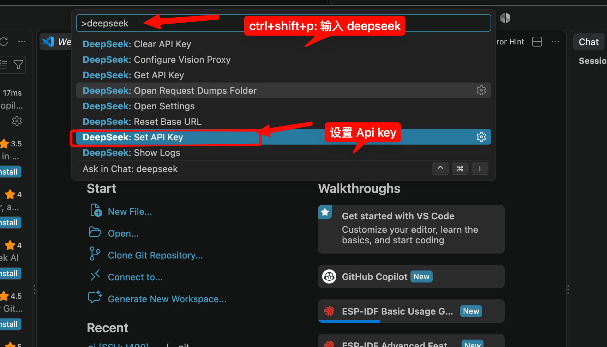
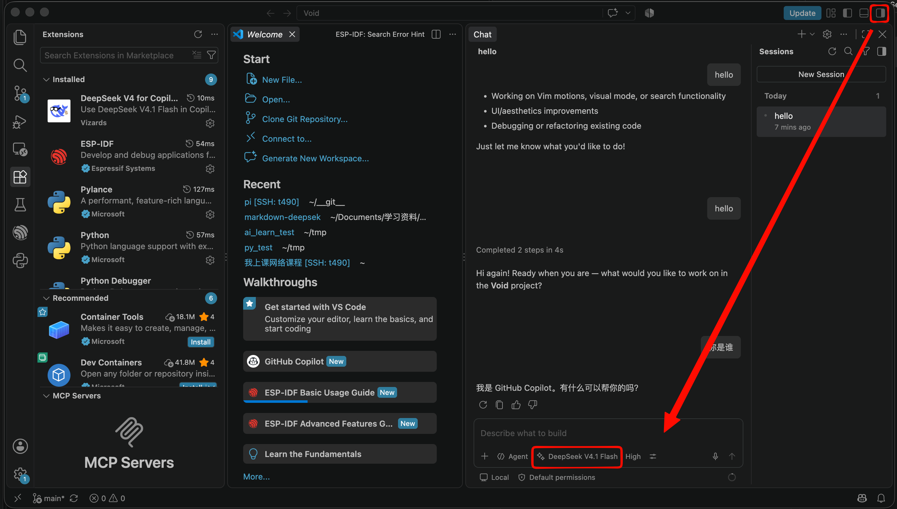

# VS Code 配置 DeepSeek

写算法题时，我们可以在 VS Code 中让 DeepSeek 帮忙解释编译错误、检查边界情况，或者讨论自己的解题思路。本篇介绍如何安装 `deepseek-v4-for-copilot` 扩展，把 DeepSeek 接入 **Copilot Chat**，并用它辅助学习。

这款扩展由第三方开发者 Vizards 维护。它为 Copilot Chat 增加 DeepSeek 模型选项，使用你自己的 DeepSeek API Key 调用服务。安装前可以查看[扩展的中文使用文档](https://github.com/Vizards/deepseek-v4-for-copilot/blob/main/README.zh-cn.md)。

## 一、准备账号和编辑器

根据扩展当前的[前置条件](https://github.com/Vizards/deepseek-v4-for-copilot/blob/main/README.zh-cn.md#前置条件)，需要准备：

- **VS Code 1.116 或更高版本**。
- **GitHub 账号及 Copilot 使用权限**：Copilot Free 即可使用，无须为了本教程购买 Pro。先在 VS Code 中登录 GitHub，确认能够打开 Copilot Chat。
- **DeepSeek 开放平台账号和 API Key**。

这里有两项独立的服务：GitHub Copilot 提供聊天界面，DeepSeek 提供模型并收取 API 调用费用。能在 DeepSeek 网页上聊天，并不代表 API 账户有可用余额。

打开 [DeepSeek 开放平台](https://platform.deepseek.com)，登录后进入 [API Keys 页面](https://platform.deepseek.com/api_keys)，创建一个 Key 并妥善保存。随后检查账户余额，需要时前往[充值页面](https://platform.deepseek.com/top_up)充值。API 按用量计费，具体标准以[官方模型与价格页面](https://api-docs.deepseek.com/zh-cn/quick_start/pricing/)为准。

**API Key 相当于调用服务的凭证。** 不要写进 `main.cpp`、公开仓库或提问内容，也不要把包含完整 Key 的截图发给别人。如果泄露，应在开放平台删除该 Key，再创建新的 Key。

## 二、安装扩展

1. 打开 VS Code 左侧的「扩展」面板。
2. 搜索 `deepseek-v4-for-copilot`。
3. 确认扩展名称为 **DeepSeek V4 for Copilot Chat**，发布者为 **Vizards**，然后点击安装。

也可以直接打开 [VS Code Marketplace 安装页面](https://marketplace.visualstudio.com/items?itemName=Vizards.deepseek-v4-for-copilot)。


## 三、配置 API Key

打开命令面板：

| 系统 | 快捷键 |
| --- | --- |
| Windows / Linux | `Ctrl + Shift + P` |
| macOS | `Cmd + Shift + P` |

输入 `deepseek`，选择 **DeepSeek: Set API Key**（中文界面为「DeepSeek: 设置 API Key」）。



在弹出的输入框中粘贴刚才创建的 Key，按回车确认。粘贴时不要额外添加引号或空格。

扩展通过 VS Code 的 `SecretStorage` 保存密钥，配置时不需要把 Key 写入 `settings.json`。使用 DeepSeek 官方服务时，通常也不需要修改 API 地址；扩展默认使用 `https://api.deepseek.com`。这些设置的说明见[扩展文档](https://github.com/Vizards/deepseek-v4-for-copilot/blob/main/README.zh-cn.md#设置项)。

## 四、选择模型，验证是否配置成功

1. 打开 VS Code 的 **Copilot Chat** 面板。
2. 点击聊天输入框附近的模型选择器。
3. 选择 **DeepSeek V4.1 Flash** 或 **DeepSeek V4 Pro**。
4. 发送一个简单问题，例如「请用中文解释 C++ 中 `int` 和 `long long` 的区别」。



收到正常回复，说明本次调用已成功。确认使用哪个模型时，应查看**模型选择器**；模型在回复中对自身身份的描述不能作为配置成功的依据。

截图中的界面包含 Agent 模式和思考强度选项。扩展版本更新后，按钮位置、模型名称可能变化，安装时以[当前扩展文档](https://github.com/Vizards/deepseek-v4-for-copilot/blob/main/README.zh-cn.md#使用步骤)为准。

## 五、让 DeepSeek 看见题目和代码

只问「我的代码为什么错了」，模型通常没有足够的信息。一次有效的提问应包含：

- **题目要求**：输入输出格式、数据范围，以及需要满足的条件。
- **自己的代码**：将 `main.cpp` 添加为聊天附件，或者粘贴需要检查的代码。
- **出现的问题**：完整的编译错误，或导致答案错误的输入、期望输出和实际输出。

可以使用聊天输入框附近的「添加上下文」或附件入口选择文件。提问前确认附件中确实包含 `main.cpp`；不要默认模型已经读过当前打开的文件。不同版本的附件入口可能显示为加号或其他图标。

题面建议提供文字。若使用截图，应保证数据范围和公式清晰；模型对图片的读取结果也需要核对。

### 示例一：检查代码，但保留自己调试的机会

附加题面和 `main.cpp` 后，可以使用下面的提示词：

```text
请根据附加的题目检查我的 main.cpp，不要修改文件，也不要重写代码。

1. 先概括我的算法思路，分析时间复杂度和空间复杂度。
2. 结合数据范围，检查数组大小、整数溢出和边界情况。
3. 如果存在 bug，指出相关代码、触发条件和原因。
4. 如果能够构造反例，给出一个尽量小的输入及期望输出。
5. 不要直接给完整答案；如果信息不足，先告诉我缺少什么。
```

检查代码时，若界面提供 **Ask（提问）** 模式，可以优先使用它。Agent 模式能够调用编辑文件、运行终端等工具，适合需要实际操作的任务；截图中选择了 Agent，使用时要留意它提出的操作。

### 示例二：理解编译错误

```text
下面是我的代码和完整编译错误。
请解释第一个导致编译失败的错误，指出对应代码，并说明如何做最小修改。
先不要处理后续可能由它引起的连锁报错，也不要修改文件。

代码：
[粘贴相关代码]

编译错误：
[粘贴完整报错]
```

### 示例三：逐步提示解题思路

```text
下面是题目和我目前的思路。
请先检查我的思路是否有矛盾，只给一个能推动我继续思考的提示。
不要直接给出完整算法或代码，等我回答后再继续。

题目：
[粘贴题面和数据范围]

我的思路：
[写出已经想到的方法，以及卡住的位置]
```

把自己的想法写出来，模型才能针对卡点给提示。得到建议后，仍应自己编译、运行样例，并检查反例。模型说「正确」不能代替证明，也不能代替评测结果。

## 六、常见问题

### 命令面板中没有 DeepSeek 命令

先确认安装的是发布者 Vizards 的扩展，并且扩展已启用。如果安装后尚未生效，可以在命令面板运行 `Developer: Reload Window`（「开发人员: 重新加载窗口」），再搜索 `deepseek`。

### 聊天面板中找不到 DeepSeek 模型

检查 Copilot Chat 是否可用、GitHub 是否已登录，以及 API Key 是否已设置。再确认 VS Code 和扩展版本满足要求。

扩展作者说明它依赖非公开的 Copilot Chat API，VS Code 更新可能带来兼容性问题。如果仍无法显示模型，可查看[扩展的问题列表](https://github.com/Vizards/deepseek-v4-for-copilot/issues)，寻找同版本的问题和处理办法。

### 发送消息后出现 API 错误

常见错误可以按下表排查，详细解释见 [DeepSeek 官方错误码文档](https://api-docs.deepseek.com/zh-cn/quick_start/error_codes)。

| 错误 | 含义 | 处理方法 |
| --- | --- | --- |
| `401` | API Key 认证失败 | 检查 Key 是否复制完整、是否已删除；重新运行设置 Key 的命令 |
| `402` | API 账户余额不足 | 到开放平台检查余额，按需充值 |
| `429` | 请求速率达到上限 | 降低请求频率，稍后重试 |
| `500` / `503` | 服务端故障或繁忙 | 等待后重试；持续失败时检查服务状态 |

如果没有错误码，先检查网络连接和是否改动过 API 地址。需要进一步定位时，可以在命令面板搜索 `DeepSeek` 并打开日志（`DeepSeek: Show Logs`）。分享日志前，应检查并移除其中的密钥、私人代码和其他敏感内容。

### 如何更换 API Key

重新运行 **DeepSeek: Set API Key**，输入新的 Key。需要清除编辑器中保存的 Key 时，运行 **DeepSeek: Clear API Key**。清除本地 Key 与删除开放平台上的 Key 是两件事；如果 Key 已泄露，还需要在开放平台撤销它。

## 参考资料

- [DeepSeek V4 for Copilot Chat 中文文档](https://github.com/Vizards/deepseek-v4-for-copilot/blob/main/README.zh-cn.md)
- [扩展安装页面](https://marketplace.visualstudio.com/items?itemName=Vizards.deepseek-v4-for-copilot)
- [DeepSeek 开放平台](https://platform.deepseek.com)
- [DeepSeek 模型与价格](https://api-docs.deepseek.com/zh-cn/quick_start/pricing/)
- [DeepSeek API 错误码](https://api-docs.deepseek.com/zh-cn/quick_start/error_codes)
