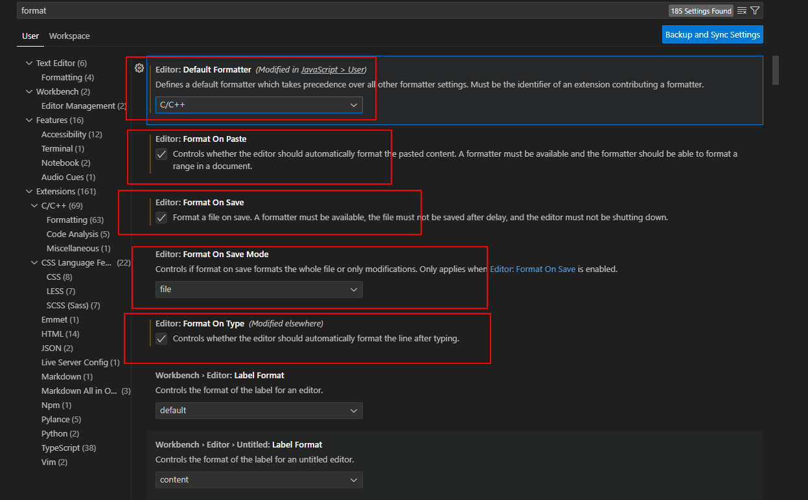

# vscode的使用

怎么自动格式化

1. 首先在vscode中安装扩展C/C++，扩展程序将自动安装clang-format。
2. 打开首选项设置（ctrl + ,），搜索format ，勾选format on save 自动保存。
3. 打开首选项设置（ctrl + ,），搜索format ，勾选format on Type 。

怎么自动保存

1. 打开首选项设置（ctrl + ,），搜索`auto save` ，选`afterDelay`。

## 配置

### 常用的配置

**自动格式化**  

在`vscode`中我们可以通过设置来实现保存文件时自动格式化代码，具体步骤如下：

首先按`Ctrl +,`或者点击`setting`(右下解齿轮图标），输入`format)

设置  

- default Formatter :c/c++
- Format on Paste
- Format on Save 
- Format on Type

这些项目



- 彩色括号 `设置-> bracket pair colorization`

### 常用的插件

- c/c++ 一定要安装
- chinese language 中文界面(最好不要安装，因为比赛的时候是英文界面)

## 运行

这里我们只通用`ctrl+alt+t`打开`terminal`,输入使用`g++ -g -o 1 1.cpp`来执行命令

第一次打开`vscode`,会自动下载一个`c/c++ language components`的东西

```
file -> new file -> select language ->选c++
```

写入下面的代码

```cpp
#include <iostream>
int main(){
    std::cout << "hello";
    return 0;
}
```

- [[ctrl]] + [[s]] 保存代码
- 保存时,创建一个`code`文件夹,并打开
- 命名为`1.cpp`,点保存


注意,如果你以后想要就在`code`目录下写代码,点击左侧边栏的`open folder`,选择刚才创建的
`code`目录,那么左侧样就会变成code目录的内容,这样以后写代码比较方便

## 3. 编译运行

1. [[ctrl]] + [[alt]] + [[arrow down]] 打开一个新的桌面
2. [[ctrl]] + [[alt]] + [[t]] 打开终端,输入编译命令

输入如下命令

```bash
# 进入code目录
cd code

# 手动编译

g++ -g -o 1 1.cpp

#运行
./1
```
## 快捷键

- [官方文档:快捷键](https://code.visualstudio.com/docs/getstarted/keybindings)
- [官方文档:快捷键](https://code.visualstudio.com/shortcuts/keyboard-shortcuts-linux.pdf)


<iframe src="/appendix/SoftWare/vscode/keyboard-shortcuts-linux.pdf" width="100%" height="600px"></iframe>

注释

- 单行注释 [[ctrl]]+[[/]],如果再按一次,取消注释
- 多行注释 [[ctrl]]+[[/]]

行操作

- 向下/上移动当前行：[[alt]] + [[⬇] / [[⬆]
- 选中当前行： [[ctrl]]+[[l]]
- 删除当前行：[[shift ]]+ [[ctrl ]]+ [[k]]
- 行增加缩进： [[ctrl ]]+ [[\[]]
- 行减少缩进： [[ctrl ]]+ [[\]]]
- 复制当前行到上一行：[[shift]]+ [[alt]] +[[up]]
- 复制当前行到下一行：[[shift]]+ [[alt]] +[[down]]
- 向下新起一行： [[ctrl]] + [[enter]]
- 向上新起一行： [[ctrl]] + [[shift]] + [[enter]]

常用

- 撤销 : [[ctrl]] + [[z]]
- 反撤销 : [[ctrl]] + [[shift]] + [[z]]
- 向下/下卷屏: [[ctrl]]  + [[⬆]] / [[⬇]]
- 向左/右跨越单词: [[ctrl]]  + [[⬅]] / [[➡]]
- 向下/上同时编辑多行(多行光标) : [[ctrl]] + [[shift]] + [[⬆]] / [[⬇]]

其它

- 显示/隐藏左侧目录栏 [[ctrl]] + [[b]]
- 控制台终端显示与隐藏：[[ctrl]]+ [[`]]
- 切换全屏： F11
- 格式化整个文件：[[ctrl]] + [[shift]] + [[i]]


## 手动修改快捷键

<video width="100%" height="360" controls>
    <source src="https://d.roj.ac.cn/d/oneDrive/RainboyVideo/rbook/vscode-shortcut-change.mp4" type="video/mp4">
    Your browser does not support the video tag.
</video>

## 调试单个文件

参考：[VS Code之C/C++程序的调试(Debug)功能简介](https://zhuanlan.zhihu.com/p/85273055)

点击左侧的调试按钮

选LLVM/GDB


怎么保证的每次调试的时候，自动读取`in`数据文件呢

修改`launch.json`的`args`参数为

```
"args": [ "<", "in" ],
```

不想每次手动在main函数下断点，希望可以自动在main停止？

在 launch.json 文件中添加 stopAtEntry 字段，并将其设置为 true。这将在程序开始时立即停止在 main 函数。

```json
{
    "version": "0.2.0",
    "configurations": [
        {
            ...
            "stopAtEntry": true,   // 将 stopAtEntry 设置为 true
            ...
        }
    ]
}
```

## 代码片段 snippets


> 代码片段（Code Snippets），指的是一些使用率很高的代码模板，可以是固定的内容（比如文件头的版权声明），或者是可以修改的预定义模板，比如for、while循环的模板。 通过Snippet，输入特定的关键词，就可以在代码段引擎的帮助下，生成预定义的模板代码，接着我们还可以通过在预定义的光标位置之间跳转，来修改补全模板，得到我们最终想要的代码。

- [vscode进阶：运用代码片段提高效率 - 知乎](https://zhuanlan.zhihu.com/p/357377511)
- [VSCode 利用 Snippets 设置超实用的代码块](https://juejin.cn/post/6844903869424599053)
- [Custom C++ User Snippet in Visual Studio Code - GeeksforGeeks](https://www.geeksforgeeks.org/custom-c-user-snippet-in-visual-studio-code/)
- [在线vscode代码片断生成](https://snippet-generator.app/)
- [VS Code 代码片段完全入门指南](https://www.freecodecamp.org/chinese/news/definitive-guide-to-snippets-visual-studio-code/)

下面是一个例子

```json
<%-include("./cpp.json") _%>
```
