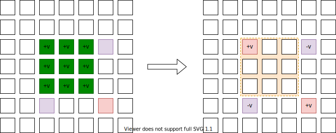

[[TOC]]

## 差分

设原数组的第$i$个元素为$a_i$,那么差分数组的第$i$个元素为$d_i = a_i- a_{i-1}$

有一组数据如下

```math
\begin{array}{r|c|c|c|c|c|c}
    
\text{下标} & 1 & 2 & 3 & 4 & 5 & 6  \\
\hline 
\text{原数组 } a[i]& 3 & 5 & 1 & 7 & 8 & 4 \\
\text{差分数组 } d[i]& 3 & 2 & -4 & 6 & 1 & -4 \\
\text{差分数组$d$前缀和 } s[i]& 3 & 5 & 1 & 7 & 8 & 4 \\
\end{array}
```

发现:对差分数组进行前缀和操作,就可以得到原数组了

```math
\begin{aligned}
S_i = \sum_{j=1}^i d_i &= d_1 +d_2 + \cdots + d_i \\
&= (a_1 - a_0)  + (a_2 - a_1) + \cdots  + (a_i - a_{i-1}) \\
&= (\bcancel{ a_1 } - a_0)  + (\bcancel{a_2} - \bcancel{a_1}) + \cdots  + (a_i - \bcancel{a_{i-1}}) \\
& = a_i - a_0 \;\;\; \text{因为$a_0 = 0$} \\
& = a_i
\end{aligned}
```


现在对原数组$a$的区间$[2,4]$上的每个数都增加$2$,得到如下

```math
\begin{array}{r|c|c|c|c|c|c}
    
\text{下标} & 1 & \color{Blue}{2}  & \color{Blue}{3} & \color{Blue}{4} & 5 & 6  \\
\hline 
\text{原数组 } a[i]& 3 & \color{Blue}{7} & \color{Blue}{3} & \color{Blue}{9} & 8 & 4 \\
\text{差分数组 } d[i]& 3 & \color{Blue}{4} & -4 & 6 & \color{Blue}{-1} & -4 \\
\text{差分数组$d$前缀和 } s[i]& 3 & \color{Blue}{7} & \color{Blue}{3} & \color{Blue}{9} & 8 & 4 \\
\end{array}
```

发现,对原数组进行区间$[2,4]$修改: 差分数组只会修改两个值，第一个值为$b_2 = b_2+2$，第二个值为$b_5 =b_5-2$,且对修改后的差分数组进行前缀后依然得到了原数组.

于是,得出结论,如果对原 数组进行区间$[l,r]$上的每个数都增加$v$,那么对应的差分数组只需要修改两位置$b_l = b_l+v$, $b_{r+1} = b_{r+1}-v$.原来需要$r-l+1$次的区间操作,现在只需要进行$2$次区间操作.也就是++把区间增减转了两次的单点增减++.大大节省了时间

对于,那些题目

- 多次区间修改(增减)
- 一次查询(查询原数组的值)

适合使用差分思想(把原数组转化成差分数组来操作)


## 思考与总结


**差分是前缀和的逆运算**

已知,原数组$a$就是数组$s$,两者一模一样.所以在这里我们其实是先假定数组$a$是数组$d$形成的前缀和数组,进行就想到++能否通过前缀和数组$a$推导出数组$d$呢?++


我们现在认为原数组$a$上每个值$a_i$都是某个数组$d$的前缀和.那么可以得到

$$
a_i = a_{i-1} + d_i \tag 1
$$

移项,进而得到

$$
d_i = a_i - a_{i-1} \tag 2
$$

通过$(2)$式,把数组$a$转化成$d$数组.也就是前缀和数组转化成差分数组

可以通过$a$得到$d$,也可以通过$d$得到$a$,他们互为逆运算

$$
a \rightleftharpoons d
$$

可以认为,$a$与$d$是同一事物的不同表现形式.


综上,可以得到如下的性质:

设$d$是原数组,$a$是$d$的前缀和,

- 在$d$的两个位置$i,j$上,同时$+v,-v$,也就是$d_i = d_i+v,d_j = d_j-v$,那么体现到$a$上,那就是区间$[i,j-1]$上的每个数都增加$v$
- 在$a$上的区间$[i,j-1]$上的每个数都增加$v$,那么体现到$d$上,那就是位置$i,j$,$+v,-v$,也就是$d_i = d_i+v,d_j = d_j-v$


## 函数思想


设$a$是一个数字组成的序列,定义函数如下:

- $f(a) = b$,把序列$a$转化成$b$,其中$b_i = \sum_1^i a_i$,也就是前缀和
- $f^{-1}(a) = b$,表示把序列$a$转化成$b$,其中$b_i = a_i - a_{i-1}$,也就是差分

显然$f$与$f^{-1}$互为逆运算,也就是

$$
f^{-1}(f(a)) = a \\
f(f^{-1}(a)) = a
$$

同样可以想到$f$与$f^{-1}$是++双射函数++,也就是$f(a) = b$ 也就是说$ranf$与$domf$++一一映射++ 

定义函数$range(a,l,r)$，表示对序列$a$区间$[l,r]$上的每个数都增加$1$

$$
range(a_1,l,r) = a_2
$$

表示$a_1$经过区间$[l,r]$上的 每个数都增加$1$后得到$a_2$,显然$a_1 \neq a_2$,则$f^{-1}(a_1) = d_1 \neq f^{-1}(a_2) = d_2$^[因为一一映射的性质]

根据差分的性质知$d_1,d_2$只有两个点不同,且这两个点是$l,r+1$

定义函数

定义函数$add(a,l,r)$，表示对序列$a$上的两点$l,r+1$分别$+1,-1$
$$
add(a_1,l,r) = a_2
$$

则$range(a_1,l,r)$与$add(d_1,l,r)$是++一一映射++的.也就是每一个在序列$a+1$上的$range$操作,都等价于在序列$d_1 = f^{-1}(a_1)$上的add操作^[这里其时使用了反证法]

## 二维差分


$$
\def\arraystretch{2}
\begin{array}{|c : c : c:c|}
\hline 
11 &-9& -3&  5\\
\hline
11 &-9& -3&  5\\
\hline
11 &-9& -3&  5\\
\hline
\end{array}
$$

根据上面的思考,可以认为此时的二维矩阵上的值,都是每个二维矩阵$d$的前缀和.也就是


$$
\begin{array}{ccccc}
   \color{Blue}{\boxdot} &  \color{Blue}{\boxdot} &\color{Blue}{\boxdot} &  \color{Green}\boxdot &  \boxdot  \\
   \color{Blue}{\boxdot} &  \color{Blue}{\boxdot} &\color{Blue}{\boxdot} &  \color{Green}\boxdot &  \boxdot  \\
   \color{Blue}{\boxdot} &  \color{Blue}{\boxdot} &\color{Blue}{\boxdot} &  \color{Green}\boxdot &  \boxdot  \\
   \color{Green}{\boxdot} &  \color{Green}{\boxdot} &\color{Green}{\boxdot} &  \color{Red}{\boxdot} &  \boxdot  \\
   \boxdot & \boxdot & \boxdot & \boxdot & \boxdot &
\end{array}
$$

$$
S_{i,j} = S_{i-1,j} + S_{i,j-1} - S_{i-1,j-1} + d_{i,j}
$$

移项,得到原二维矩阵上的每个值为:

$$
d_{i,j} = S_{i,j}-S_{i-1,j}-S_{i,j-1} + S_{i-1,j-1}
$$


对$S$矩阵上的子矩阵$(x_i,y_i),(x_j,y_j)$进行$+v$操作,反应到$d$上就是

- $(x_{i-1},y_{i-1}),(x_{j+1},y_{j+1})$上的每个数都$+v$
- $(x_{i},y_{j+1}),(x_{j+1},y_{i})$上的每个数都$-v$

小技巧: 点$d_{i,j}$的值是$S_{i,j} - S_{i-1,j} - S_{i,j-1} + S_{i-1,j-1}$,
也就是说,与以$i,j$作为左下角的四个格子的值有关.也就是说$i,j$的覆盖范围,有奇数个$+v$时才会产生影响.




题目: <%- pid_to_url('luogu', '3397','地毯') %>

## 练习题目


- <%- pid_to_url('luogu', '2367','语文成绩') %>
- <%- pid_to_url('vjudge', 'HDU-1556','Color the ball') %>
- <%- pid_to_url('vjudge', 'POJ-3263','Tallest Cow ') %>
- <%- pid_to_url('luogu', '3406','海底高铁') %>
- <%- pid_to_url('luogu', '4552','[Poetize6] IncDec Sequence') %>
- HDU 1121
- luogu 3948 
- luogu P1969 积木大赛
- P6070
- P3655
- P7404
- roj 求最少多少次把所有的元素变成一样大,平数II
