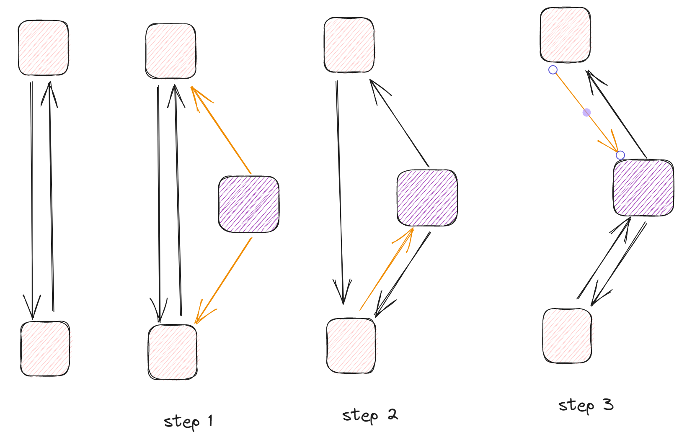
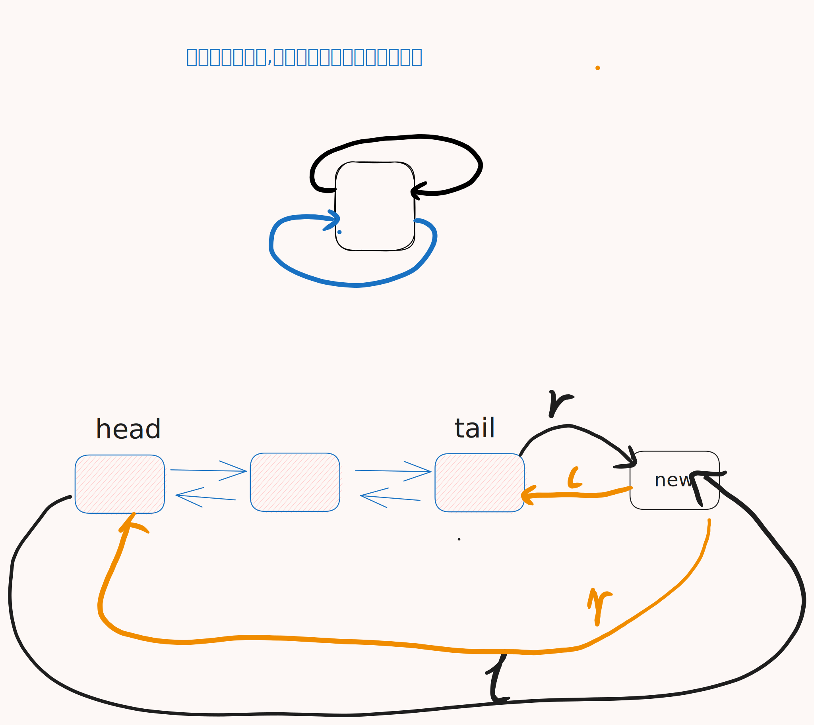

一个用来解决**精确覆盖问题**的类似十字链表的数据结构,配合DFS加剪枝使用.

具有以下的操作

- 初始化
- 添加
- 移除
- 恢复






```cpp
<%- include("dlx_template.cpp") _%>
```

## 参考

- [AcWing 1067. 精确覆盖问题 DLX - itdef - 博客园](https://www.cnblogs.com/itdef/p/14108020.html)
- [166. 数独 dancing links 方法 - itdef - 博客园](https://www.cnblogs.com/itdef/p/11337878.html)
