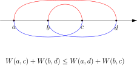
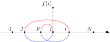

## 四边形不等式定义

::: colorfulbox 

定义$1$: 四边形不等式 

设$w(i,j)$是整数集合上的二元函数.如果对于定义域上的任意整数$a,b,c,d$,其中$a \leqslant b \leqslant c \leqslant d$,都满足$w(a,b) + w(c,d) \leqslant w(a,c) + w(b,d)$,则称$w(i,j)$满足四边形不等式.

交叉和小于包含和.

:::

> 四边形不等式准确的说应该叫做**反四边形不等式**,因为它的公式与下图所示的公式正好相反
> 

::: colorfulbox 

定理$1$: 四边形不等式等价定义

:::

$$
f(i,j) = \min\{f(i,k)+f(k+1,j) + w(i,j) \}  \quad (1 \leqslant i  \leqslant k < j \leqslant n)
\tag a
$$

::: colorfulbox 

定理$2$: 一维四边形不等式具有决策单调性 

在状态转移方程$f(i) = \min\{f(j) + w(j,i) \}  \quad (0 \leqslant j < i)$中,如果$w(i,j)$满足四边形不等式,则$f(i)$具有[[[rbook: decision_mono]]].

::: 

证明:

为了方便,设$f(i)$的最优决策点为$p$,那么根据最优决策点的定义,对于$\forall i \in [1,N],\forall j \in [0,p-1]$,有:

$$
f(p) + w(p,i) \leqslant f(j) + w(j,i) \tag 1
$$

设$i{'} \in [i+1,N]$,因为$w(j,i)$满足四边形不等式.

$$
w(j,i^{'}) + w(p,i) \geqslant w(j,i) + w(p,i^{'}))
$$

移项: 

$$
w(p,i^{'})) - w(p,i) \leqslant w(j,i) - w(j,i^{'}) \tag 2
$$

$(1)+(2)$得:

$$
f(p) + w(p,i^{'}) \leqslant f(j) + w(j,i) \tag 3
$$

满足决策单调性的定义,证明完毕.

::: colorfulbox 

定理$3$: 二维决策单调性 

在满足四边形不等式的条件下,状态转换方程$(a)$中,记$P[i,j]$表示$f(i,j)$取最小值的$k$值,即$f(i,j)$的最优决策点,则有对于任意的$i<j$,有:

$$
P[i,j-1] \leqslant P[i,j] \leqslant P[i+1,j] \tag b
$$

:::

解释: $P[i,j-1] \leqslant P[i,j]$类似一维决策单调性,固定$i$不变,$j$增加$1$,则新区间下最优决策点右移.或者说,设$P[i,j-1] = p$,则在对于$f(i,j)$来说区间$[i,p-1]$的值不可能成为最优决策点.

解释: $P[i,j] \leqslant P[i+1,j]$,固定$j$不变,$i$减少$1$,则新区间下最优决策点左移.或者说,设$P[i+1,j] = p$,则在对于$f(i,j)$来说区间$[p+1,j]$的值不可能成为最优决策点.

证明:

证明完毕.

总结: 本质是就是四边形不等式一维决策单调性在两个方向上的推广.

例如石子合并问题

一般的代码

::: pseudocode

:::

使用"四边形不等式优化"后的代码

::: pseudocode

:::

## 复杂度证明

朴素的石子合并时间为$O(n^3)$,而使用"四边形不等式优化"后的时间复杂度为$O(n^2)$,即$O(n^2)$的多项式时间复杂度.

## 石子合并完整代码

见 [[[p: roj-3175]]] 的解析

## 题目列表

+p THIS_ID

## 参考

- 算法竞赛 - 罗勇军 5.1 四边形不等式优化
- [Optimum binary search trees
Prof. Dr. D. E. Knuth][1]
- [Efficient dynamic programming using quadrangle inequalities F. Frances Yao][2]

[1]: https://www.semanticscholar.org/paper/Optimum-binary-search-trees-Knuth/c020b9fc5215297a4cc14cff7e1be4dcd9a05d44 "Optimum binary search trees Prof. Dr. D. E. Knuth"
[2]: https://cse.hkust.edu.hk/mjg_lib/bibs/DPSu/DPSu.Files/p429-yao.pdf "Efficient dynamic programming using quadrangle inequalities F. Frances Yao 1980 Proceedings of the twelfth annual ACM symposium on Theory of computing - STOC '80"
