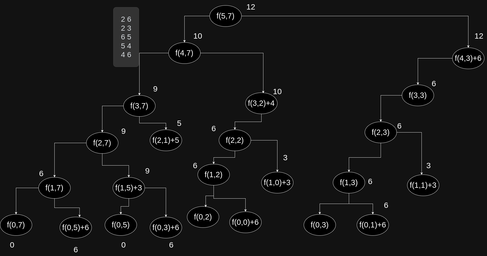
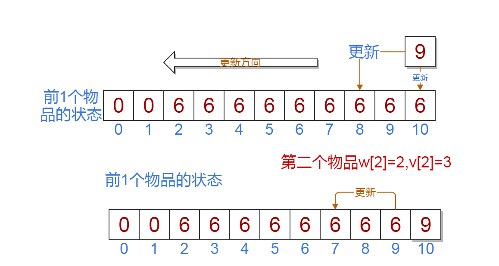

[[TOC]]


## 题目引入

<%- include("./problem.md") %>

## 问题分析


### 解析一:暴力

使用[[[rbook: 01_seq]]]的思想.很容易想到每个物品,要么选,要么不选,所以这里只要枚举原来的物品序列的所有子集,然后找到最大的那个值即可.


::: fold
```cpp
<%- include("./code/01seq.cpp")%>
```
:::

输出的结果

::: fold
```
<%- include("./code/01seq_out.txt")%>
```
:::

### 解析二: 递归

小朋友法.每个小朋友拿着一个物品(或者每个物品就是一个小朋友),现在你是最后一个小朋友,很容易想到,你代表的物品有两种可能性,在最终的那个最好的答案中,要么装入背包,要么不装入背包.

当你代表的物品没有被装入背包时,这个时候最简单,想当于最后这个物品不存在(可以这样想:一开始最后这个物品,就不存在). 那么这个时候问题就变成:**前$i-1$个物品在容量为$C$的背包下的最大值**,设为$f(i-1,c)$

当你代表的物品没有被装入背包时,可以这样等价: 先把这个物品装入这个背包(物品装入的顺序不影响最终的答案),此时背包的容易减少了$w_i$,那么这个问题目变成了一个新的问题:**前$i-1$个物品在容量为$C-w_i$的背包下的最大值**,设为$f(i-1,c-w_i)$


于是,这样每个小朋友只要不停的询问前面小朋友问题$f(i,j)$,最后得到就可以得到最终答案$f(n,C)$

最简单的问题(边界)是: 前$0$个物品,或容量变成$0$,这个时候的答案显然是$0$

显然,得到公式如下:


$$
f(i,j)=
\left\{
\begin{array}{cc}
 0&  i==0 \lor j == 0 \\
 f(i-1,j) & j<w[i] \\
 max\{f(i-1,j),f(i-1,j-w[i])+v[i]\}& j>=w[i]
\end{array}
\right.
$$


为了加快代码的运行速度,再使用[[[rbook: fibonacci]]]里的**记忆化**方法,得到代码如下:



::: fold
```cpp
<%- include("./code/recur.cpp")%>
```
:::

### 解析三: DP

按照填表法,我们可以轻易的把解析二的递归法写成`for`循环法.

<%- video("knapsack01.mp4") _%>


但是这里,我还是给出利用集合得到DP方程的方法.

$$
\begin{array}{c|c|c}
\text{编号} & \text{重量} & \text{价值}  \\
\hline \\
1 & w_1 & v_1 \\
2 & w_2 & v_2 \\
\cdots \\
n & w_n & v_n 
\end{array}
$$

设$Q(i,j)$表示前$i$元素形成的所有子集的集合,且子集的$\sum w < j$,显然$\max {Q(i,j)} = f(i,j)$,符合**每一个问题对应一个集合**的规律 


现在考虑最后一个元素$(w_n,v_n)$,它有可能出现答案对应的子集合里吗? 显然这里有两种可能性.

1. 没有出现在答案对应的子集里,这个时候要去$Q(i-1,j)$里去找答案.

2. 出现在答案对应的子集里,那么我们要去集合$A = \{ x | x \in Q(i,j) , last(x) = n\}$,也就是我们要从$Q(i,j)$里挑出那些元素:最后一个值是$n$的元素,组合成集合$A$,显然集合$A$中的每一个元素都去除$n$之后,就变成了集合$Q(i-1,j-w_n)$(这里用到了一一映射的思想). 显然只找到$Q(i-1,j-w_n)$的最值,然后加上$v_n$就得到了集合$A$的最值.

综上,得出:


$$
f(i,j)=
\left\{
\begin{array}{cc}
 0&  i==0 \lor j == 0 \\
 f(i-1,j) & j<w[i] \\
 max\{f(i-1,j),f(i-1,j-w[i])+v[i]\}& j>=w[i]
\end{array}
\right.
$$


对于一种物品，要么装入背包，要么不装。所以对于一种物品的装入状态可以取0和1.我们设物品i的装入状态为$x_i$,$x_i \in \{0,1\}$，此问题称为0-1背包问题

我们设$f(i,j)$表示前i个物品在容量为j的条件得到的最大价值.

$f(0,j)$,前0个物品得到的价值为0,也是边界.
其中$f(i-1,j)$表示前i-1个物品在容量为j的条件得到的最大价值,也就是不选第i个物品.
其中$f(i-1,j-w[i])+v[i]$表示前i个物品中一定选第i个物品的条件下得到的最大价值.
$f(5,7)$就是我们最后要求的答案.


## 朴素代码

注意我们这里的边界是f[0][j].

```cpp
<%- include("./code/1.cpp") %>
```

## 滚动数组

在上面的动画中,我们发现第$i$行状态只能由上一行得到,也就是说我们根据不需要$n$行的二维数组来存状态值,只需要两行的二维数组即可.

我们又知道在`C++`中,异或运算的特点如下: 

```cpp
int cur = 1;
cur = cur ^ 1; // cur = 0
cur = cur ^ 1; // cur = 1
```

cur与1异或,可以不停的变成0,1,0,1,0,1...,达到了一种切换(toggle)的效果.

所以我们可以用滚动数组来优化空间复杂度.

代码如下:

```cpp
<%- include("./code/roll_array.cpp") %>
```


## 01背包一维写法

看完上面的代码演示和仔细考虑过代码和状态转移方程后,你会发现一些重要的规律:

 - 每一行的状态都需要上一行(前一层)的状态推导出来
 - 第i行的第j个状态f[i][j]一定是由f[i-1][j]和f[i-1][k]得到的,且k一定小于j

根据上面的规律,我们可以这样做:

 - 定义一个一维的数组f[j]表示状态:f[j]表示前i个物品在容量为j的条件下的最大价值
 - 我们可以很容易的得到第一个物品的所有的状态
 - 在处理前2个物品的状态的时候从f[7]到f[0]倒过来处理

上面的操作可以把01背包的二维状态压缩到1维,节省了空间和代码复杂度.



<%- video("knapsack01_1d.mp4") _%>


### 伪代码

```cpp
for i=1->N //前i个物品
    for j=C->w[i] //容量从大到小
        f[j] = max(f[j],f[j-w[i]]+v[i])
```

### 代码

```cpp [g1:cpp]
#include <cstdio>

//手动初始化数据
int n=5,c=7;
int w[] = {0,2,2,6,5,4};
int v[] = {0,6,3,5,4,6};

//清空置零,同时前0个物品,边界
int f[11]={0};

void Knapsack01(){
    int i,j;
    for(i=1;i<=n;i++)//前i个物品
        for(j=c;j>=w[i];j--){
            if(f[j] < f[j-w[i]]+v[i])
                f[j] = f[j-w[i]]+v[i];
        }
}
int main(){
    Knapsack01();
    printf("%d",f[7]);//输出答案
    return 0;
}
```

```py [g1:python3]
<%- include("./code/01knapsack_1dimensional.py")%>
```

```haskell [g1:haskell]
<%- include("./code/01_knsapsack.hs")%>
```

代码演示: http://dsa.rainboy.cc/#/01Knapsack1


## 恰好装满


有的时候题目会问我们**恰好装满背包**时最优解.

这种时候,在初始化的时候除了$F[0]$为0,其它$F[1..V]$设为$-\infty$,这样就可以保证最终得到的$F[V]$ 是一种恰好装满背包的最优解。


这是为什么呢？可以这样理解：初始化的$F$数组事实上就是在没有任何物品可以放 入背包时的合法状态。如果要求背包恰好装满，那么此时只有容量为 0 的背包可以在什么也不装且价值为 0 的情况下被“恰好装满”，其它容量的背包均没有合法的解，属于未定义的状态，应该被赋值为$-\infty$了。如果背包并非必须被装满，那么任何容量的背包都有一个合法解“什么都不装”，这个解的价值为 0，所以初始时状态的值也就全部为0了。

这个小技巧完全可以推广到其它类型的背包问题，后面不再对进行状态转移之前的初始化进行讲解。


```
5 7
5 8
3 4
1 3
2 5
4 6
```


图解:


<%- iframe("/canvas/01_knapsack/fill_up.html")%>


得到状态转移方程为,其中$f(i,j) = -1$ 表示无解：

```math
f(i,j) = 
max \left\{
\begin{array}{ccc}
0 & j = 0 \text{容量为0的解为0}\\
f(i-1,j) & \text{不选第i个物品}\\
f(i-1,j-w[i]) + v[i] & f(i-1,j-w[i]) \ne -1 \land j \geqslant w[i]
\end{array}
\right.
```

二维写法的代码如下：

::: fold
```cpp
<%- include("./code/just_fill_up_2d.cpp") %>
```
::: 

再根据普通01背包的一维写法，可以得到公式为

```math
f(j) = max \{ f(j),f(j-w[i]) +v[i] \}
```

只要倒过来枚举容量进行计算

```cpp
<%- include("./code/just_fill_up.cpp") %>
```


有很多表示那种能否到达,(前i个物品选j个能否达到某个重量),这种情况下可以抽象成01背包的恰好装满,比如`砝码称重(cojs)`,`猫狗大战(vijos)`等

**题目地址:**[luogu P2347 砝码称重](https://www.luogu.org/problemnew/show/P2347)

状态转移方程:设$f[v]$表达重量$v$能不能达到.

$$f[v]=\left\{\begin{matrix}
 1&v==0 \\
 f[v-w[i]]& v-w[i]>0
\end{matrix}\right.$$

```c
#include <cstdio>
#include <cstring>

int a[] = {0,1,2,3,5,10,20};
int num[10] = {0};
int f[1010] = {0};

int main(){
    int i,j,k;
    for(i=1;i<=6;i++)
        scanf("%d",&num[i]);

    f[0] = 1; //边界,前0个砝码,容量为0的条件是是可以达到的
    for(i=1;i<=6;i++)
        for(j=1;j<=num[i];j++)
            for(k=1000;k>=a[i];k--)
                if(f[k] == 0 && f[k-a[i]] == 1)
                    f[k] = 1;
    int cnt = 0;
    for(i=1;i<=1000;i++)
        if( f[i] == 1)
            cnt++;
    printf("Total=%d",cnt);
    return 0;
}
```

## 01背包记录路径.

用二维数组来记录，$path[m][n]$ 。其中$m$表示物品（$m<=$物品数），$n$表示背包状态（$n<=$背包容量）。

比如 $path[i][j]$ 表示物品 $i$ 放在了状态 $j$ 的背包中。 前提条件：$path$数组全部为$0$，

代码实现记录路径：

```c
for(int i=0;i<n;i++)
	for(int j=V;j>=v[i];j--)
		if(f[j]<f[j-v[i]]+w[i])
		{
			f[j]=f[j-v[i]]+w[i];
			path[i][j]=1; //把装进去的物品标记一下
		}
```

路径读取代码：

```c
int i=n-1,j=V; //V：背包容量。n个物品 
while(i>=0&&j>=0)
{
	if(path[i][j])//物品i在j里 
	{
		printf("%d ",i);//把物品i的编号输出 
		j-=v[i];  //读完了物品i，找下一个背包状态 
	}
	i--; 
}
```

## 题目2:猫狗大战

题目地址：[luogu P1489 猫狗大战](https://www.luogu.org/problemnew/show/P1489)

**解析**

如果一共有$n$个人,那么其中的一队的人数一定是$n/2$  
设总血值为$sum$,如果知道了从$n$个人中选$n/2$人后所能形成的血值的可能值$blood$,那么另一队的血值为$sum-blood$,所以两队的血值的差值为$\|sum-2\times blood\|$  
进而题目转为求:**n个人中选n/2的可能达到的血值**

设$f[i][k][j]$表示前$i$人中选$k$个人后能不能达到血值$j$,显然有:

```math
f[i][k][j] =
\left\{\begin{matrix}
 f[i-1][k][j]& \\ 
 or & \\
 f[i-1][k-1][j-v[i]]& 
\end{matrix}\right.
```
 - $v[i]$表示第$i$个人的血值
 - $f[i-1][k-1][j-v[i]]$表示选第$i$个人
 - **注意:**前$i$个人最多选$i$个人,所以$k<=i$
 - **边界:**$f[0][0][0]=1$,表示前$0$个人,选$0$个人,可以达到血值$0$

**我们可以画出如下的状态转移过程图:**

数据:有$3$个人,血值分别是:$1,2,3$


**三维写法的代码**
```c

#include <cstdio>
#include <cstring>
#include <cmath>
using namespace std;


int f[201][101][4010]  = {0};
int n;
int a[201];
int sum = 0;

void swap(int &a,int &b){
    int t= a;
    a = b;
    b =t;
}


int main(){
    scanf("%d",&n);
    int i,j,k;
    for(i=1;i<=n;i++){
        scanf("%d",&a[i]);
        sum += a[i];
    }


    f[0][0][0] = 1;
    for(i=1;i<=n;i++) //枚举前i个人
        for(k=1;k<=i && k <= n/2;k++ )
            for(j=0;j<=sum;j++)
                if( f[i-1][k][j] == 1 || f[i-1][k-1][j-a[i]] == 1)
                    f[i][k][j] = 1;

    int ans = 999999999;
    int t1,t2;
    for(i=0;i<=sum;i++)
        if( f[n][n/2][i] == 1){
            if( ans > abs( sum-2*i)){
                ans = abs( sum-2*i);
                t1 = i;
                t2 =sum-i;
            }
        }
    if( t1 > t2)
        swap(t1,t2);
    printf("%d %d\n",t1,t2);
    return 0;
}
```

**注意**:根据题意,你应该开的数组大小为$f[201][101][8001]$,占用的内存为$201*101*8001*4/1024/1024=609mb$,会超内存,这个时间我们应该把三维压成二维的

我们设$f[k][j]$,省掉$i$,根据上面的三给的转移,你会发现第$k$行的数据,一定需要第$k-1$行的数据.**所以我们应该先从大到小枚举$k$,然后枚举$j$,一行一行的更新**


**二维写法的代码**

```c
#include <cstdio>
#include <cstring>
#include <cmath>
using namespace std;


int f[201][8001] = {0};
int sum=0,a[201]; //存血值
int n;

void dp(){
}

int main(){
    scanf("%d",&n);
    int i,j,k,half=n>>1;
    for (i=1;i<=n;i++){
        scanf("%d",&a[i]);
        sum += a[i];
    }

    //dp
    f[0][0] = 1; //边界
    for(i=1;i<=n;i++) //枚举前i个人
        for(k=half;k>=1 ;k--)//枚举选k个人,倒过来
            for(j=a[i];j<=sum;j++){
                if(f[k][j] == 0 && f[k-1][j-a[i]] == 1)
                    f[k][j] = 1;
            }

    int ans = 0x7f7f7f7f;
    int t1,t2;

    //要从0开始,因为有可能一队里有0个人
    for(i=0;i<=sum/2;i++) //i<sum/2 i是较小的那队血值
        if( f[half][i]){
            if( abs( sum-2*i) < ans ){
                ans =  abs ( sum-2*i);
                t1 = i;
                t2 = sum -i;
            }
        }
    printf("%d %d\n",t1,t2);
    return 0;
}
```

## 总结


01背包问题是最基本的问题,它包含了背包问题中设计状态,方程的最基本思想.另外,别的类型的背包问题往往转换成01背包问题求解.故一定要仔细体会上面基本思路的得出方法.状态转移方程的意义,以及空间复杂度怎么被优化.


已知量是什么

首先明确问题是什么,也就是什么符号来具体的描述问题

显然问题的与两个关键参数有关

- 背包的大小C
- 物品的集合A

当两者不同时得到的答案,可以不同.
当两者参数完全一样时,答案完全一样.


## 暴力解,枚举所有的组合


时间为$O(2^n)$

也就是说我们通过组合枚举算法得到了一个C下在任意集合的解的方法,只是时间很慢,但这个方法是正确的


时间为$O(2^n)$

最后得到了一个解的物品集合,用01串来表示这个每个物品是否在最后的解的集合内,也就是最终的解有没有$a_i$这个物品,

从集合分类的(分解子问题)角度来分析,最后一个物品$a_n$要么是0(没有选),要么是$1$(选了)

显然得到

$$
f(C,A) = \max 
\left\{
\begin{array}{ll}
f(C,A-\{a_n\})  & \text{没有选$a_n$} \\
f(C-W(a_n),A-\{a_n\}) + V(a_n) & \text{选$a_n$}
\end{array}
\right.
$$

为了简化集合的表示,可以用$f(C,i)$表示:前$i$个物品,在容量为$C$的背包下的最大价值,这样就可以使用数字来表示物品集合了


$$
f(C,n) = \max 
\left\{
\begin{array}{ll}
f(C,n-1)  & \text{没有选$a_n$} \\
f(C-W(a_n),n-1) +V(a_n) & \text{选$a_n$}
\end{array}
\right.
$$


边界

那个这个问题,会不停的缩小,到什么程度会不用计算就可以得到答案?只有1个物品?只有0个物品?

显然只有0个物品的时间,显然$f(C,0) = 0$

结合上面的是暴力算法,我们写出下面的代码,得到如下的二维表格

那么整个题目是否是变成一个填写二维表格的问题呢?

如何更快带的完成这个表格呢?

根据上面的公式,结合表格数据,可以发现,如下的规律

表格的$(i,j)$点的数据是由

1. $(i,j-1)$,上面的格子
2. $(i-W(j),j-1)$,上面的格子的左W(j)的格子

得到了,

那么这可以写出下面的代码,所以动态规划又叫填表法.


### 总结:

01背包本质是一个

- 集合分类问题
- 一维序列的上的问题
- 和组合的公式的求解方法一样

<%- include("./practice.md")%>

