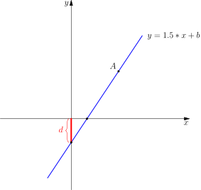
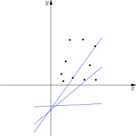
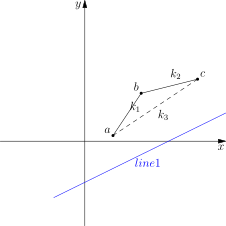
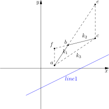

[[TOC]]

## 前置知识:线性规划

> 斜率优化的思想其实和高中数学的线性规划有相似之处，因此建议没学过的同学先了解一下线性规划

这个视频讲解了高中的线性规划的相关知识
https://www.bilibili.com/video/BV1qg4y1v7Xy?p=4


一元一次函数:$y = k \cdot x + b$,它的函数图像如下所示




其中$k,b$为定值,$k$为直线的斜率

由图可知如下的事实:


1. 这条直线$l$上的所有点$(x_l,y_l)$都符合:$y_l - k \cdot x_l ==d$或者反过来说:在坐标
轴上所有符合$y - k \cdot x = d$的点会组成一条直线,这条直线就是$l$
2. $B$为直线$l$与$y$轴的交点,同时也是直线$l$上的点,所以$y_B - k \cdot x_B = d$,此时$x_B == 0$,
所以得到:
$y_B = d$

我们把这个距离称为**截距**.也就是说:直线$l$上的所有点$y_l - k \cdot x_l$的值就是这个截距.


::: colorfulbox

截距的性质

直线上的任意一个点的$(y,x)$的差值$y-x$的值就是截距

:::


### 斜率优化

问题: 如下图所示,有多个点$a_i$分布在坐标轴上,有一条直线$y = k \cdot x + b$,其中$k>0$且为定值,$b$可以变化(这意味着,直线可以上下平移),那么如何选择一点$a_i$,使直线经过该点时,使$b$值,也就是截距最小?



当我们选取一了一条直线,那么这条直线的斜率$k$就是固定的,此时只能上下平移的去移动这条直线,那么这个直线的截距$b$就是变化的.根据[[[rbook: monotonic_queue]]]的思想:++排除不可能的点++.我们不禁会想哪些点是不可能的点?


从候选的点集中任意取三个点$a,b,c$,如下图所示.
设$K(i,j)$为点$i,j$之间的斜率,即$K(i,j) =\frac{\varDelta y}{\varDelta x} = \frac{y_j - y_i}{x_j - x_i}$.
且这三个点满足发下的条件:

1. $x_a < x_b < x_c$
2. $K(a,b) = k_1 > k_2 =K(b,c)$

::: oneline





::: 


::: colorfulbox

定理$1$: $k_3 = K(a,c)$,$k_2 < k_3 < k_1$

先证明$k_3 < k_1$.延长直线$a,b$到达与$y=x_c$的交点$e$.$k_1 = K(a,b)= K(b,e) = \frac{y_e - y_b}{x_e - x_b}$.又因为$k_1 > k_2$,所以$\frac{y_e-y_b}{x_e - x_b} > \frac{y_c-y_b}{x_c-x_b} = k_2$.由定义可知:$x_e = x_c$,所以$y_e - y_b > y_c -y_b \Rightarrow y_e > y_c$.由上得到:

$$
k_3 = \frac{y_c - y_a}{x_c - x_a} < \frac{y_e-y_a}{x_c - x_a} = k_1 \tag a
$$

再证明$k_2 < k_3$.延长直线$c,b$到达与$y=x_a$的交点$f$.$k_2 = K(b,c)= K(f,b) = \frac{y_b - y_f}{x_b - x_f}$.又因为$k_1 > k_2$,所以$\frac{y_b-y_a}{x_b - x_a} > \frac{y_b-y_f}{x_b-x_f} = k_2$.由定义可知:$x_f = x_a$,所以$y_b - y_a > y_b -y_f \Rightarrow y_a < y_f$.由上得到:

$$
k_3 = \frac{y_c - y_a}{x_c - x_a} > \frac{y_c-y_f}{x_c - x_f} = k_1 \tag b
$$
 
综合$(a),(b)$得到:$k_2 < k_3 < k_1$.

:::

::: colorfulbox

推论$1$: 截距大小与斜率之间的关系


如图所示: $k_1$表示直线$a,b$的斜率,直线$l_2$的斜率$k_{l_2} < k_1$,直线$l_1$的斜率$k_{l_1} > k_1$. 证明: 

设$B(l,k,a)$表示有一个斜率为$k$直线$l$且结过点$a$的截距,$B(l,k,a) = y_a - k \cdot x_a$.

1.当直线$l$的斜率$k_1 > k_{l}$时,直线$l$经过点的截距$B(l,k_l,a) < B(l,k_l,b)$.

证明: 因为$k_1 > k_{l} \Rightarrow \frac{y_b - y_a}{x_b - x_a} > k_l \Rightarrow y_b -y_a > k_l \cdot (x_b - x_a)$,

$$
\begin{aligned}
B(l,k_l,b)- B(l,k_l,a) &= y_b - k_l \cdot x_b - (y_a - k_l \cdot x_a)  \\
&= (y_b - y_a) - k_l \cdot (x_b - x_a) \\
&> 0
\end{aligned}
$$


2.当直线$l$的斜率$k_1 < k_{l}$时,直线$l$经过点的截距$B(l,k_l,a) > B(l,k_l,b)$.证明方法同上.

> 综上: 当有两个点$a,b$ 且 $x_a < x_b \land K(a,b) > 0$时,直线$l$的$k$值如果小于$K(a,b)$,那么经过$a$的截距小于经过$b$的截距.如果直线$l$的$k$的值如果大于$K(a,b)$,那么经过$b$的截距小于经过$a$的截距.

:::


::: colorfulbox
定理$2$: $b$不可能成为答案.

设
- $k$表示直线$line1$的斜率
- $b_a = y_a - k \cdot x_a,b_b = y_b - k \cdot x_b,b_c = y_c - k \cdot x_c$
- $b_a,b_b,b_c$分别表示直线$line1$经过点$a,b,c$时的截距.

那么现在只需要证明:$b_a \leqslant b_b \lor b_c \leqslant b_b$的恒成立.


根据推论1,分情况讨论:

1. $k < k_2 < k_1$,此时$b_a < b_b$.
2. $k_2 < k < k_1$,此时$b_c < b_b$.
3. $k_3 < k_1 < k$,此时$b_c < b_b$.

所以无论$k$的值是哪种情况,$b$都不可能成为答案.

:::


::: colorfulbox

推论$2$: 可能为答案的点集形成下凸壳

在后选点集(例如figure_2)里排除不可能点后形成一个$k$单调增加的序列,也就是下凸壳.


反证法: 假设$k$不是单调增加的,那么存在一对相邻的$k_i > k_{i+1}$,根据定理$2$,中间点$a_{i+1}$不可能成为答案,与前提**排除所有不可能点**矛盾.


:::


::: colorfulbox

推论$3$: 第一个$k_i>k$的起点就是最小截距

当直线$l$的斜率为$k$的时,经过下凸壳的哪个点时截距最小?

所有$k_i < k$总是终点较优,所有$k_i > k$总是起点较优.又因为下凸壳上的$k_i$在递增. 所以直线$l$经过第一个$k_i>k$的起点时得到最小截距.如果不存 在$k_i>k$,那么最后一个点就是最小截距.

:::

## 入门: 玩具装箱

题目地址: [[[p: luogu-3195]]]

## 解析

根据题目的意思可以很轻松的写出状态转移方程

$$
\begin{equation}
dp[i] = \min\limits_{j < i}\{dp[j] + (sum[i] +i - sum[j]-j-L-1)^2 \} \tag 1
\end{equation}
$$

其中,$sum[i] = \sum\limits_{1}^{i}{C_k}$,也就是前缀和.显然如果直接按这个方程来做,复杂度为$O(n^2)$

### 使用 斜率优化

发现公式$(1)$是一个关于两个变量$i,j$二元公式.其中变化的只有$j$,如果我们可以把是的变化拆分成两个部分$(X(j),Y(j))$,那么$j \in [1,i-1]$的每一次变化都会产生一对点,这些点都分布在平面上. 

且我们想到得到的值是:$min\{k \cdot X(j) + Y(j)\}$,$k$为定值,那不就是求斜率为$k$的直线经过那对点可以得到小截距吗?那么问题就为上面斜率问题.


设

```math
\begin{aligned}
k(i) &= sum[i] + i - L -1 \\
X(j) &= sum[j] + j
\end{aligned}
```

则可以得到

```math
\begin{aligned}
dp[i] &= \min\{dp[j]+(k(i) - X(j)) ^2\} \\
&= \min\{dp[j] + k(i)^2 - 2\cdot k(i) \cdot X(j) + X(j)^2\} \\
&= \min\{\fcolorbox{red}{aqua}{$ - 2\cdot k(i) \cdot X(j) + dp[j] + X(j)^2$} + k(i)^2\}
\end{aligned}
```

再设

```math
\begin{aligned}
Y(j)   \quad &= \quad dp[j] + X(j)^2
\end{aligned}
```
因为$k(i)$是定值,所以可以把$k(i)^2$移出来,则得到

```math
dp[i] = \min\{\fcolorbox{red}{aqua}{$ - 2\cdot k(i) \cdot X(j) + Y(j) $}\}  + k(i)^2
```

我们注意到``\fcolorbox{red}{aqua}{$- 2\cdot k(i) \cdot X(j) + Y(j) $}``形如``z = kx+y``,
我们设直线``l(j)``表示为:

```math
l(j) = -2  k(i)\cdot X(j) + Y(j)
```

于是就得到

```math
dp[i] = \min\{\fcolorbox{red}{aqua}{$ l( j ) $}\} + k(i)^2
```

显然我们要求的是``\min\{l(j)\}, 1 \leqslant j < i``,这个公式表示的意思就是: 我们要求直线方程线性规划$l(j)$的最小值

定义域为$j \in [1,i)$之间形成的点集$P:\{(X(1),Y(1)), (X(2),Y(2)), \cdots \}$

对于点集$P$中的每一个点$p$,都会有一条斜率为$k(i)$的直线经过$p$,直线上的点
代入公式$k \cdot x + y$的值一样
,而它们的值就是**截距**


所以我们只需要找到最小的截距


同时,基于上面的公式,我们可以知道以下事实:

- $k(i)$值为正值,且随着$i$单调增加

证明 需要维护一个凸包

凸包上的哪个点是答案

凸包上的如何添加点

所以

我们需要维护一个下凸壳

且壳上的点斜率递增

1. 在壳上找到最优点
2. 在壳上添加新的点


## 更一般的公式推断

我们有一个这样的状态转移方程

$$dp[i]=\min\limits_{j\in[l,r]}\{d(j)+B(i)+X(j) \cdot k(i)\}$$

- $X(j) \cdot k(i)$ 表示既与$i$有关又与$j$有关的项,因为$i$是固定的,通常$X(i)$的值也是定值
- $d(j)$ 表示只与$j$有关的项
- $B(i)$ 表示只与$i$有关的项,因为$i$是固定的,通常这个项的值也是定值

这样就可以看成这样的一条直线的公式

```math
\colorbox{aqua}{ $ l_j \Rarr y = k(i) \cdot x + d(j) $}
```

那可以把原式子写成

\begin{equation}
dp[i]=\min\limits_{j\in[l,r]}\{\colorbox{aqua}{ $l_j(k(i) )$ } \}+d(i)
\end{equation}

所以对于每一个状态$i$,可以得到对应的$k(i)$,那么根据$l_j$就得到了对的值

也就是$l_j$这条直线的**线性规划**


对于本题来说

\begin{equation}
dp[i]=\min\limits_{j\in[l,r]}\{\colorbox{aqua}{ $l_j(k(i) )$ } \}+d(i)
\end{equation}

X(j) 是
K(i) 是

为什么我们需要维护一个下凸壳


? 那么第一个满足条件的P值 如何求解最值,找到第一个斜率大于$k(i)$的点

为什么要维护一个单调队列

单调队列如何添加点

如何得到头(update)


TODO

dp[0]应该是什么值?


## 方法2 : 推理法

## TODO

我需要使用asymoto
画图
所以需要 asymoto的笔记

## 代码1: 朴素

```cpp
#include <ios>
```

## 代码2: 模块

## 参考

- [P3195 [HNOI2008]玩具装箱TOY（斜率优化入门） - hhz6830975 的博客 - 洛谷博客](https://www.luogu.com.cn/blog/hhz6830975/p3195-hnoi2008-wan-ju-zhuang-xiang-toy-xie-shuai-you-hua-ru-men-post)
