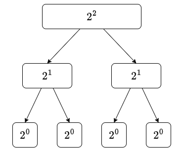
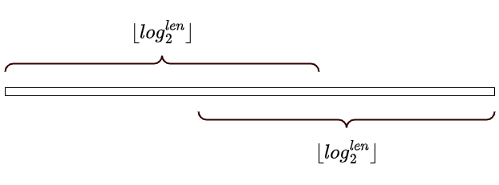

[[toc]]

## 学习目标

- 理解 ST 表的原理
- 倍增思想
- ST 表的构建
- ST 表的查询


## 问题引用

<%- include("./problem.md")%>

## 暴力解法

显然可以想到暴力解法，对于每个询问，枚举区间 $[l,r]$ 中的最大值，每一次查询的时间复杂度为 $O(n)$，总时间复杂度为 $O(n^2)$。

::: fold
```cpp
<%- include("./baoli.cpp") %>
```
:::

显然这个代码只能拿到部分分。对于$10^5$的数据规模会$\mathcal{TLE}$。

## 倍增思想
  
## 第一步: 创建ST表

ST表,$spare\ table$本意稀疏矩阵

它基于,下面的一种基本区间思想

1. 一个长度为$2^k(k\geqslant 1)$的区间$A$可以平均分成左右长度为$2^{k-1}$两部分$B,C$
2. 区间最值$max(A)$可以由$max(B)$和$max(C)$得到: $max(A)=max\{max(B),max(C)\}$

如果我们把区间$A$按这种思想不停的分割,最后会得到一个树状结构,每个节点代表一个区间,树的高度为$k+1$,叶子结点代表长度为$2^0$,表示原区间上的单个点的值.

这显然是一种DP,因为符合DP的无后效果性原则(DAG).



于是我们想到对于整个序列$[1,n]$,我们可以得到这个序列信息$f(i,j)$,表示从位置$i$开始的长度为$2^j$的区间的最大值.


> TODO: 这里是不是需要一个图,或一个P5的动画来解释一下这个DP运行的过程?

代码如下:

```cpp
<%- include("./code/snippet_st_init.cpp") %>
```

TODO: 写一个vue的动画


## 得到$\lfloor log_2^n \rfloor$

这里给三种方案

### 1. 使用换底公式

```cpp
int log2(int n) {
    return log(n)/log(2);
}
```

### 2. 使用dp思想

这里使用数学思想,对于整数$n$来说,它的$\lfloor log_2^n \rfloor$等价于$b$对应的二进制$bin(n)$只保留最高位置的1,其余位置全部置为0后得到的数.

可以想到这个数字$highbit(n)$对应的为: $bin(n) \gg 1$后再$highbit( n \gg 1) +1$.

于是我们得到公式

$$
highbit(n) = highbit(n\gg 1) +1
$$

比公式(DP方程)的正确性,可以使用数学归纳法证明.

```cpp
// 存储每个数字对应的最高位是第几位
int  highbit[maxn]; 
void init_highbit() {
    highbit[0] = -1;
    for(int i = 1; i <= n; i++) {
        highbit[i] = highbit[i>>1] + 1;
    }
}

//得到对应的$\lfloor log_2^n \rfloor$
int log2(int n) {
    return 1 << highbit[n];
}
```

### 3. 使用 `__builtin_clz`

`__builtin_clz()`是gcc内置的函数,可以得到数字对应的二进制左边的0的数量.


```cpp
template<typename T
T log2(T n) {
    return 1<< ( sizeof(T) *8 - 1 - __builtin_clz(n) );
}
```


## 查询

初始化后，应该如何查询区间最值呢？

### 重要证明

对于任意区间$[l,r]$,都有$2 \times \lfloor log_2^{r-l+1} \rfloor \geqslant r-l+1$.

这表明,对于任意区间$[l,r]$,按如下操作,都能覆盖整个区间.




设长度$len = r-l+1$,

根据二进制原理,这是显然的.因为$\lfloor log_2^{len} \rfloor$把最高位的$1$保留,其它位置全部置为$0$,这样两个数加起来一定超过$len$

$$
\def\arraystretch{1.5}
\begin{array}{cccc}
\boxed{1} & \boxed{0} & \cdots & \boxed{0} \\
\boxed{1} & \boxed{0} & \cdots & \boxed{0} \\
\end{array}
$$

## 动画


<%- iframe("/canvas/st_table/index.html") %>

## ST 表的时间复杂度分析

- 初始化每个元素$i$开头最多做$log_2^n$次，总时间$nlogn$.其实看一下$f(i,j)$数组大小就知道了。
- 显然查询是$O(1)$


```cpp
template<typename T
T log2(T n) {
    return  sizeof(T) *8 - 1 - __builtin_clz(n) ;
}

int query(int l,int r) {
    int k = log2(r-l+1);
    return max(f[i][k],f[i+(1<<k)][k]);
}
```

## ST 表的应用

- 静态区间最值查询
- dp优化
- 其它？TODO

## 模板代码

综合上面的代码

```cpp
<%- include("code/st_template.cpp")%>
```

TODO 统一所有的函数的名字