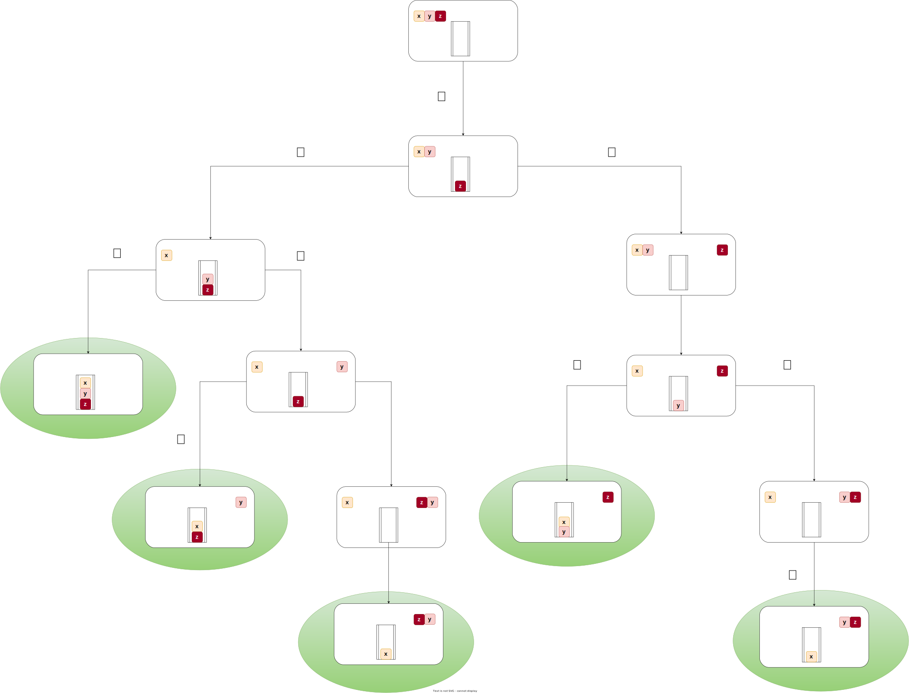

## 题目

<%- include("./problem.md") %>

## 解析


这是一个经典的进出栈的问题,是一个求catalan数的经典问题.

## 解析0, 人脑计算器 🧠

小朋友,看题目后,你是否有很多的疑惑!!??还记得我说过的话吗:

- 一定要把样例,手动算出来,你算了吗
- 用纸和笔,就是你最简单的计算器
- 暴力出奇迹,你现在的暴力,会成为你后面思考的养分

我们在纸上模拟计算整个过程:




按这种方法,我可以把1到5内的所有的数都计算出来,然后打表输出,得部分的分.


发现了吗

1. 上面的东西本质是一个递归树
2. 每一次的操作都把一个++状态++转变成新的++状态++
3. 树上的每个结点就是一个的状态
4. 如果你告诉一个人: 某时刻,在哪个结点,也就是当前的状态是什么,他都继续画图.
5. 答案就是树上的某个叶子结点(有颜色的点)数量
6. 如何描述结点上的状态?
  1. 待入栈队列
  2. 栈内队列
  3. 已经出栈的队列


## 解析1,暴力枚举

想像有两个小朋友,a和b,

- a在不停的入栈,记为$1$(使栈增加1)
- b在不停的出栈,记为$-1$

可以想出来,在某一个时刻,要么是a的入栈,要么是b在出栈,那么a和b共操作$2n$次,

显然最后会得到一个长度为$2n$的,由$1,-1$组成的操作序列. 

好. 现在使用最暴力的想法,有一个长度为$2n$的数据,每个位置随机填1或-1,填完后得到一个序列$s_1$

但$s_1$不一定是合法的序列,那么哪些是合法的序列呢?

- 1,-1各有n个
- 操作序列的任意位置的前缀和$\geqslant 0$,也就是任意前i个位置中,-1的数量不能超过1.你想一想.

每个位置有两种可能性,共有$2^{2n}$种可能性, 因为$n \leqslant 18$,最大为$2^{36} > 10^8$,所以会超时,但是可以过部分分数,代码如下


```cpp
<%- include("./baoli.cpp") _%>
```
## 解析1.2, 打表

你可能会问,这个代码有什么用,不是超时吗? 呵呵,😎,打表啊!!!!!!

## 解析2, 优化

上面使用了递归写了一个暴力枚举的程序,它显然不好,假如小朋友b是放-1的时候,就需要考虑前面1的数量,不能随机的放

于是使用小朋友法,a,b两个小朋友,

- a放1,最多只能放n次
- b放-1,最多只能放n次,且不能超过前面的小朋友a的放的数量

按这种原则操作,不会出现不合法的序列,这个叫做剪枝,后面会讲.

重新写代码如下,此代码会超时一个点: https://www.luogu.com.cn/record/149547178


```cpp
<%- include("./baoli2.cpp") _%>
```

## 解析3

**状态**: 某个时刻,在1.等待入栈的队列,2.栈内的元素,3.已经出栈的队列. 如果你能用详细的描述这个3个值是什么样子的,那么也就知道在树上那个位置,那么答案也就确定了.

所以描述**状态**后,显然一个状态,最多转化成两个新的**状态**

1. 从入栈的队列取一个加入栈中 
2. 栈内的元素不空的情况下,弹出一个元素


于是我们写出如下的代码

```cpp
<%- include("./dfs_1.cpp")%>
```

## 解析4,记忆化,DP,数字描述状态 


根据解析0的递归树,容易相到,

每个节点的都是一个状态,都对应了一个答案数值: 出栈序列

$f\{ (x,y),(z),() \}$表示

- 待入栈队列$x,y$
- 栈内队列$z$
- 出栈的队列,空

$$
f\{ (x,y),(z),() \} = f\{ (x),(y,z),() \} + f\{ (x,y),(),(z) \}
$$

关键在于,我们无法把**序列**作为状态,然后写代码.

为什么不能,不能用数组存序列吗? 因为不能存值,不能使用数组作为索引然后去查找值.

$f\{(x,y),(z),()\} = 5$,我们需要把这个结果存下来,那如何把$(x,y),(z),()$作为索引去查找对应的值呢?

下面是核心:

最简单的想法:

- 初始有$1$个元素等入栈,那么答案是定值
- 初始有$2$个元素等入栈,那么答案是定值
- $\cdots$
- 初始有$n$个元素等入栈,那么答案是定值

所以,在刚开始还没有入栈的时候,只需要知道待入栈的队列的长度,不需要知道具体是那些数(其实需要知道这些数互不相同),最后会得到一个定值的答案

进一步的想,如果栈内也有元素,答案也是定值吗?

- 有$1$个元素等入栈,有$1$个元素在栈内,那么答案是定值
- 有$1$个元素等入栈,有$2$个元素在栈内,那么答案是定值
- 有$2$个元素等入栈,有$2$个元素在栈内,那么答案是定值
- $\cdots$

所以,设$i$表示待入栈的队列的长度，设$j$表示栈内的数量,$f(i,j)$表示这种状态下的答案,那么$f(i,j)$是定值

还不懂,看下面的图


同样观察上面的figure1发现: 当待入栈的数量与栈内的数量固定时,得到结果是一定的.也就是说,

- 树上的每一个节点都是一个状态
- 答案只和数值有关,和顺序无关(从树上的任意一个结点开始分解,下面树的形态是固定的)

核心

- 题目可以画成树分解的形态,那这个问题就是可递归的
- 树上的每个结点都是一个++状态++,关键就是在于如果描述这个状态
  - 状态的描述,基本上都是数字,因为可以索引


进一步描述

$f(i,j)$,下标 $i$ 表示队列里还有几个待排的数,$j$ 表示栈里有 $j$ 个数，$f(i,j)$表示此时的情况数

然后，有两种情况：

- 栈空,我们不可以弹出栈里的元素，只能进入，所以队列里的数$−1$，栈里的数$+1$，即加上 $f(i−1,j+1)$
- 栈不空,那么此时有两种情况
  1. 出栈$1$个,产生新的状态为(分解成一个新的问题):$f(i-1,j+1)$
  2. 入栈$1$个,变成,$f(i,j-1)$
- 边界:数全在栈里了,就只剩$1$种可能了,$f(0,n)=1$

$$
f(i,j) = \left\{
    \begin{array}{cr}
    f(i-1,j+1) + f(i,j-1) & i>0 \land j > 0 \\
    f(i-1,j+1) & i > 0 \land j = 0\\
    1 & i = 0 
    \end{array}
\right.
$$

```cpp
<%- include("./code/solve_3.cpp") %>
```


## 解析 3.1

同样可以想到,设

- $b$:已经出栈的队列的长度(也就是栈的次数),
- $a$:栈内的数量

$g(a,b)$应该也是可以分解的,因为$g(a,b)$可以转化成$f(i,j)$,因为++一一映射++


但是也可以看上图,figure1,

- 要么出栈:$g(a,b) \to f(a-1,b+1)$
- 要么入栈:$g(a,b) \to f(a+1,b)$

TODO 

$$
f(a,b) = 
$$

## 解析4,化归法

本问题,可以转化为,在一个只有一半网格上,从左下角到右上角一共有多少种走法.

这样就转化成了数字三角形问题,得到的DP方程,和解析3一样.

## 解析5 catalan数

本题目是经典的catalan数问题化归法

看这个视频: https://www.bilibili.com/video/BV14P411T7TZ/


TODO, 这里要改成跳转`< jump_to() >` 语法


公式具体见 本书的`math/catlan`


根据公式,直接写代码.
