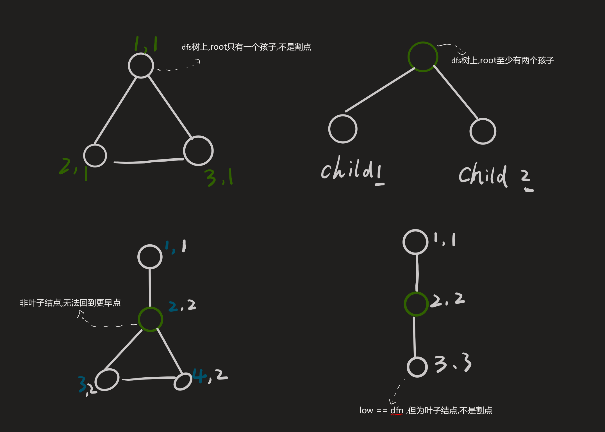
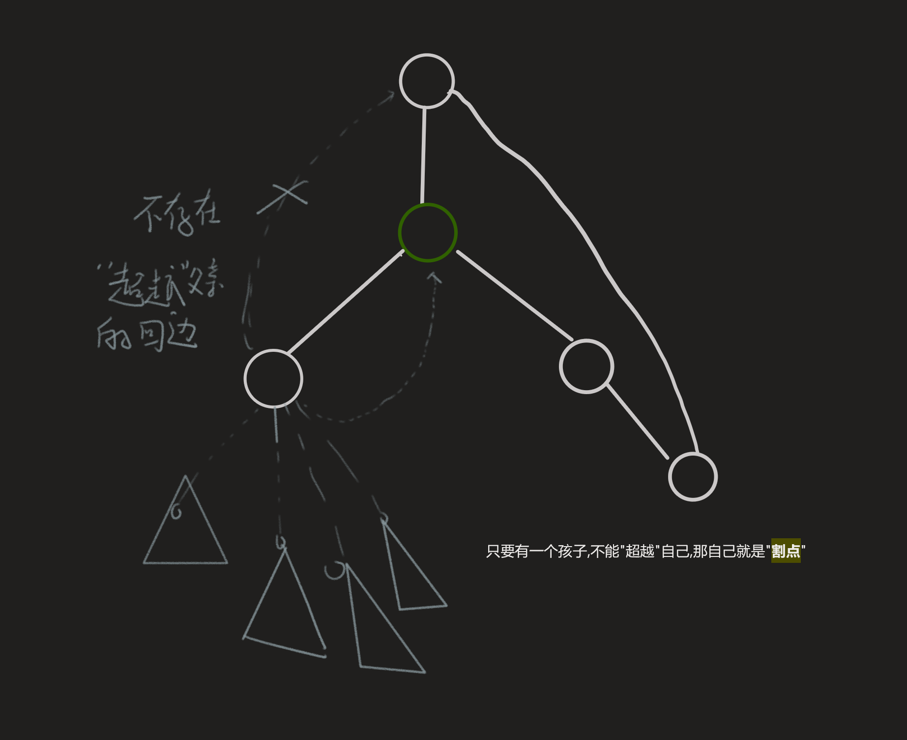

## 原理

以下的讨论都在dfs树上

1. 显然,dfs树上叶子结点不可能是割点
2. 显然,dfs树上的root结点有超过1个孩子,root是割点
3. 在dfs树上,非叶子,非root点u,如果存在一个孩子v,v在不走父子边的情况下,不能达到**超越**父亲u,则u点是割点





## 代码模板


- `dfn` 是 `Depth First Number` 的缩写，意为深度优先搜索序列编号。

```cpp
<%- include("template.cpp") _%>
```
