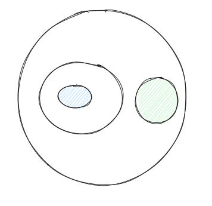
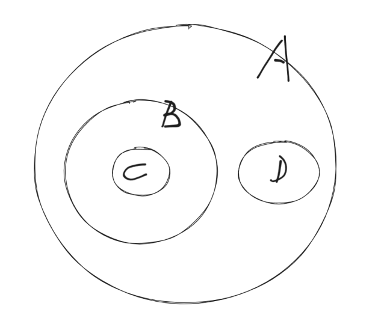
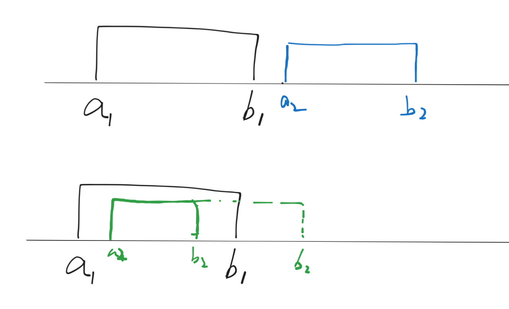

## 区间选点证明

题目：Radar Installation AcWing112

对于这个问题的抽象:

1. 多个区间，添加最少点，使得每个区间都含有点。
2. 最少点使得多个区间含有点。
3. **区间选点**问题。

### 基本思路 $O(n^2)$

区间 $a, b$ 有两种关系：1. 分离 2. 含有公共部分（包含，相交）。

每个区间都可以看成一个集合，这个问题就变成了使用最少的元素，使得每个集合都至少含有一个元素（决策集合）。

对于任意关系的集合 $A_1, A_2, \dots, A_n$ 来说：

1. **情况 1**：如果有 $n$ 个集合，且这 $n$ 个集合的交集不为空，那么答案集合就是这 $n$ 个集合的交集。
2. **情况 2**：$n$ 个集合的交集是空集，如下图所示，答案集合是两个集合：

   

3. **结论**：当你做出一个答案集合 $X$ 之后，如果能更小（发现和另一个答案集合 $Y$ 有交集，那么答案就是 $X \cap Y$），那就更小。

对于某个集合 $A_1$ 来说，如何找到它所对应的答案集合呢？根据上面的结论：

1. 使用集合 $A_1$ 和其他集合 $A_2, A_3, \dots, A_n$ 尝试进行交集运算，得到的最小非空集合就是答案集合。
2. $A_1 \cap A_i \cap A_j \cap \dots \ne \varnothing$，$X = \{A_i \mid A_1 \cap \bigcap A_i \ne \varnothing \}$，那么 $X$ 集合里面的元素就是我们所要找的和 $A_1$ 集合交起来非空的那些集合。
3. 这样的话，我们把 $X$ 集合里的元素全部打上标记，从原集合里面去除，在剩余的集合里面再去按照这个方法去寻找。
4. 总体时间复杂度为 $O(n^2)$。

### 优化 $O(n)$

上面的时间复杂度为 $O(n^2)$，那么，还有更快的方法吗？

如果我们可以对所求的集合进行排序，使得属于同一个 $X$ 集合（即 $X$ 集合内部的所有集合相交不为空），例如 `A B C D`，`C B A D`。

那么我们就可以从头到尾进行遍历，因为集合的交集运算是一种迭代运算，当我们算到某一步，发现交集为空时，我们就得到了一个答案。

那么这个排序后的序列，后面的问题就可以作为一个整体问题，这显然是一种 DP 或者是分解子问题的思想。

回到这一个区间选点问题，如果我们对区间进行排序（先按照区间的起始位置，然后再按照区间的结束位置），我们能够保证交在一起的区间都在一起吗？

对于排序后的第一个区间 $[a_1, b_1]$ 来说，它和第 2 个区间有两种关系：

1. **情况一**：两个区间没有公共部分，则第一个区间和后边的所有的区间都不会有公共部分，此时去除第一个区间之后，问题变成一个新的子问题。
2. **情况二**：第一个区间和第 2 个区间有交集（存在公共部分）：
   1. 根据上面的推导：则这个答案区间一定是这两个区间的交集 $B$。
   2. 此时此刻第 1 个区间和第 2 个区间可以从数轴上删除，添加一个新的区间，也就是他们俩的交集 $B$，显然并不会影响最终答案。
   3. 重复执行操作 2，直到变成情况一，此时就会得到第一个答案区间，也就是区间 $[a_1, b_1]$ 所对应的答案区间。
3. 显然，上面这种操作是递归，根据所学知识，所有的递归都是可以使用数学归纳法来证明（上面的整个过程显然是正确的）。

**由此，我们证明完毕我们的贪心过程。**

还有一个重要的结论：会枚举每一个区间，所以不会漏。
