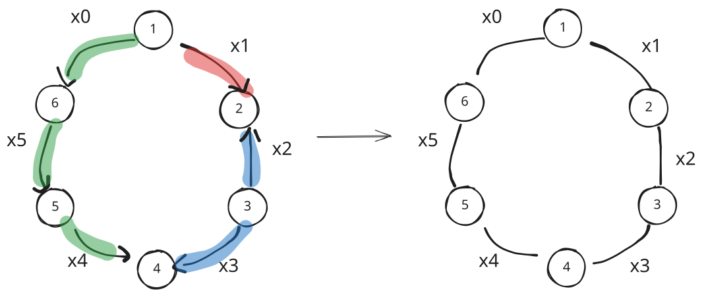
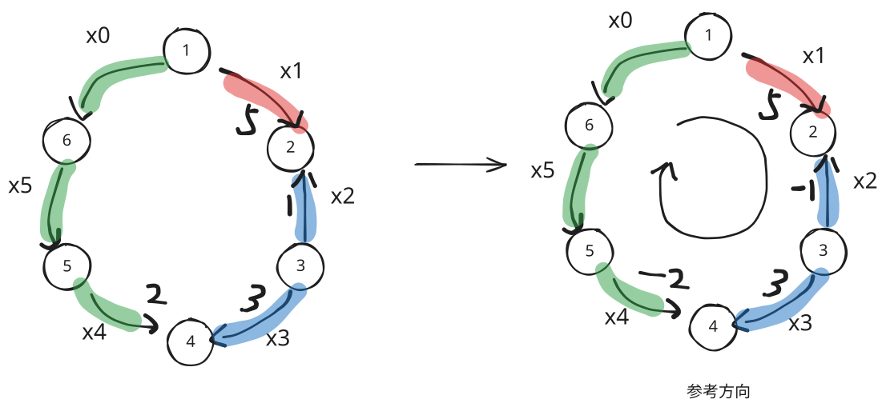
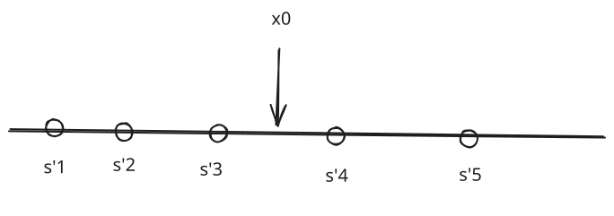
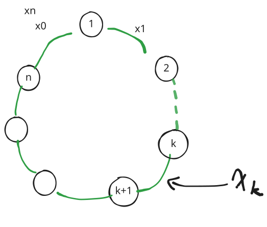

# 均分纸牌问题详解

均分纸牌（Equalizing Playing Cards）是贪心算法与前缀和技巧中极其经典的经典模型。该问题常见于各类算法竞赛，从最基础的一维线性链式结构，延伸到首尾相连的环形结构，乃至二维网格上的独立分解。

本文将从最基础的**线性均分纸牌**出发，逐步深入到**环形均分纸牌**的严谨代数与几何证明，并给出高效的代码实现。

---

## 一、线性均分纸牌

### 1. 问题描述

有 $n$ 堆纸牌，排成一行，编号为 $1, 2, \dots, n$。每堆纸牌有 $a_i$ 张，已知所有纸牌的总张数 $\sum_{i=1}^n a_i$ 是 $n$ 的倍数。

我们可以在相邻的两堆之间移动纸牌：每次可以将某堆纸牌的一部分（任意张数）移动到相邻的另一堆中。

**目标**：
1. **最小移动次数**（常见于 NOIP2002「均分纸牌」）：只要两堆之间发生了移动，无论移动多少张，都记为 1 次操作。求使每堆纸牌数达到平均数的最少移动次数。
2. **最小转移纸牌总量**：若移动 $k$ 张纸牌的代价为 $k$，求使得每堆纸牌数相等所需的最小总转移牌数 $\sum |x_i|$。

### 2. 贪心策略与数学推导

设每堆牌最终达到的目标平均张数为：

$$\bar{a} = \frac{1}{n} \sum_{i=1}^n a_i$$

定义第 $i$ 堆牌的**净需求量（差值）**为：

$$p_i = a_i - \bar{a}$$

显然有全局平衡条件：

$$\sum_{i=1}^n p_i = 0$$

- 若 $p_i > 0$，表示第 $i$ 堆有多余的纸牌，需要向外流出；
- 若 $p_i < 0$，表示第 $i$ 堆缺少纸牌，需要从外部补充；
- 若 $p_i = 0$，表示当前堆已达到平衡。

#### 从局部到整体的递推

考虑排在最左侧的第 1 堆牌：
- 它只有右边相邻的第 2 堆牌与之相连。
- 因此，第 1 堆要达到平衡，多余或缺少的 $p_1$ 张牌**必须且只能**通过第 1 堆与第 2 堆之间的通道进行移动。
- 我们将这 $p_1$ 张牌传递给第 2 堆，第 2 堆的净差值变为 $p_2 + p_1$。
- 如果 $p_1 \ne 0$，则发生了一次移动。

同理，处理完第 1 堆后，第 2 堆与第 3 堆之间的传递量必须为 $p_1 + p_2$。

依次类推，第 $i$ 堆与第 $i+1$ 堆之间必须传递的纸牌净量为：

$$S_i = \sum_{k=1}^i p_k$$

这就是净差值数组的前缀和！

#### 核心结论

1. **求最少移动次数**：
   在第 $i$ 堆与第 $i+1$ 堆之间，只要前缀和 $S_i \ne 0$，就必然需要发生至少一次纸牌传递；而若 $S_i = 0$，说明前 $i$ 堆整体已经自给自足，两者之间无需传递。
   因此：
   $$\text{最少移动次数} = \sum_{i=1}^{n-1} [S_i \ne 0]$$

2. **求最小传递牌数总量**：
   每堆之间的传递代价为 $|S_i|$，故最小总牌数为：
   $$\text{最小传递总牌数} = \sum_{i=1}^{n-1} |S_i|$$

### 3. 参考实现（线性均分纸牌）

```cpp
#include <iostream>
#include <vector>
#include <numeric>

using namespace std;

int main() {
    ios::sync_with_stdio(false);
    cin.tie(nullptr);

    int n;
    if (!(cin >> n)) return 0;

    vector<int> a(n);
    int sum = 0;
    for (int i = 0; i < n; ++i) {
        cin >> a[i];
        sum += a[i];
    }

    int avg = sum / n;
    int ans = 0; // 最少移动次数
    int cur_prefix = 0;

    for (int i = 0; i < n - 1; ++i) {
        cur_prefix += (a[i] - avg);
        if (cur_prefix != 0) {
            ans++;
        }
    }

    cout << ans << "\n";
    return 0;
}
```

---

## 二、环形均分纸牌

### 1. 问题描述

现在将纸牌（或糖果、硬币）排成一个**首尾相连的环**：第 1 堆不仅与第 2 堆相邻，还与第 $n$ 堆相邻。

每次只能在环上相邻两堆之间传递纸牌，每次移动 1 张牌的花费为 1。问：将所有堆的牌数调整为相同所需的**最小传递纸牌总数**是多少？

> **典型问题**：
> - 洛谷 P2512 [HAOI2008] 糖果传递
> - AcWing 122. 糖果传递
> - 洛谷 P2125 环形均分纸牌

---

### 2. 证明一：可链化性质（必有一处不传递）

解决环形问题的核心往往在于**断环成链**。我们先证明一个关键定理：

> **定理（可链化性质）**：  
> 必然存在一个最优解，使得环上某两堆相邻的元素之间**没有发生任何纸牌交换**。

#### 反证法证明

设命题 $\neg P$ 为：*存在某组数据，在它的所有最优解中，任意两个相邻的元素之间都必须发生纸牌交换（不存在传递量为 0 的边）。*

我们将相邻两堆都发生交换的情形称为**“封闭流动”**。



给每一条边编号为 $x_0, x_1, \dots, x_{n-1}$。我们规定：**顺时针方向传递为正，逆时针方向传递为负**。

所求的最小交换纸牌总数为：

$$\text{Total} = \sum_{i=0}^{n-1} |x_i|$$

设每个点的净流出值为 $p_i = a_i - \bar{a}$，且 $\sum_{i=1}^n p_i = 0$。

#### 参考方向与平衡方程

取顺时针为统一的**参考方向**：



对于每一个点 $i$，顺时针进入它的边为 $x_{i-1}$，顺时针流出它的边为 $x_i$。由流量平衡定理：

$$\text{流入} - \text{流出} = \text{净增量} = -p_i$$

即：

$$x_{i-1} - x_i + p_i = 0 \implies x_i = x_{i-1} + p_i$$

因此，只要确定了某一条边（例如 $x_0$）的传递量，其他所有边的传递量都可以由 $x_0$ 线性表示：

$$
\begin{aligned}
x_0 &= x_0 \\
x_1 &= x_0 + p_1 \\
x_2 &= x_1 + p_2 = x_0 + p_1 + p_2 \\
x_3 &= x_2 + p_3 = x_0 + p_1 + p_2 + p_3 \\
&\;\;\vdots \\
x_{n-1} &= x_0 + \sum_{k=1}^{n-1} p_k
\end{aligned}
$$

记前缀和 $s_i = \sum_{k=1}^i p_k$（显然 $s_n = 0$）。则所有边的流量均可表示为：

$$x_i = x_0 + s_i \quad (0 \le i \le n-1)$$

总代价函数可以写成单变量 $x_0$ 的函数：

$$F(x_0) = \sum_{i=1}^n |x_0 + s_i|$$

#### 函数 $F(x_0)$ 的单调性与极值



若假设 $\neg P$ 成立，即所有最优解中每个 $x_i \ne 0$，则说明最优的 $x_0$ 绝不能等于任何一个 $-s_i$。

将所有 $-s_i$ 从小到大排序得到关键点序列 $s'_1 \le s'_2 \le \dots \le s'_n$。在任意不含端点的开区间 $(s'_j, s'_{j+1})$ 内，$F(x_0)$ 中每一项绝对值的正负号都是确定的：

$$F(x_0) = (2j - n) x_0 + C \quad (\text{其中 } C \text{ 为常数})$$

这是一个**分段一元一次函数**：
- 若 $2j - n > 0$，$F(x_0)$ 单调递增，将 $x_0$ 减小到区间左端点 $s'_j$ 结果更优；
- 若 $2j - n < 0$，$F(x_0)$ 单调递减，将 $x_0$ 增大到区间右端点 $s'_{j+1}$ 结果更优；
- 若 $2j - n = 0$，$F(x_0)$ 在该区间内为常数，端点处取值与区间内相同。

无论如何，最优解必然可以在某个端点 $x_0 = -s_k$ 处取得！
而当 $x_0 = -s_k$ 时：

$$x_k = x_0 + s_k = -s_k + s_k = 0$$

即第 $k$ 条边不需要发生传递，原问题成功断开为一条链！这与“任意相邻两项都必须交换”的假设矛盾。

**证毕：必然存在一个最优解在某处不传递，环形均分纸牌问题必然可以断环成链。**

---

### 3. 证明二：求断开位置与中位数定理

既然可以在某处断开，我们如何寻找最优的断开位置呢？



假设我们在边 $x_k$ 处断开（即令 $x_k = 0$）。从第 $k+1$ 个元素开始顺时针重新推导各边传递量：

$$
\begin{array}{c|l}
\hline
\text{边} & \text{传递量} \\
\hline 
x_{k+1} & p_{k+1} = s_{k+1} - s_k \\
x_{k+2} & p_{k+1} + p_{k+2} = s_{k+2} - s_k \\
\vdots & \vdots \\
x_n & \sum_{j=k+1}^n p_j = s_n - s_k = -s_k \\
x_1 & x_n + p_1 = s_1 - s_k \\
x_2 & x_1 + p_2 = s_2 - s_k \\
\vdots & \vdots \\
x_k & s_k - s_k = 0 \\
\hline
\end{array}
$$

可以发现，无论在何处断开，所有边的代价总和统一具有如下极简形式：

$$F(k) = \sum_{i=1}^n |s_i - s_k|$$

#### 货仓选址模型（绝对值不等式）

上式在几何意义上完全等价于经典的**货仓选址问题**：

> 数轴上有 $n$ 个点，坐标分别为 $s_1, s_2, \dots, s_n$。要求在数轴上选取一个点 $s_k$，使得所有点到 $s_k$ 的距离之和最小。

由绝对值不等式：

$$|s_a - x| + |s_b - x| \ge |s_a - s_b|$$

当且仅当 $x$ 位于 $s_a$ 与 $s_b$ 之间时取等号。

因此，将序列 $s$ 从小到大排序后：
- 最优点 $s_k$ 必然取为序列 $s$ 的**中位数**！
- 此时距离和达到全局最小值：

$$\min \sum_{i=1}^n |s_i - s_{mid}| \quad \text{其中 } s_{mid} = s\left[\left\lfloor \frac{n+1}{2} \right\rfloor\right]$$

---

### 4. 算法步骤与复杂度

1. 求总牌数和平均数 $\bar{a} = \frac{1}{n}\sum a_i$。
2. 构造差值前缀和数组：$s_i = s_{i-1} + a_i - \bar{a}$。
3. 对数组 $s_1, s_2, \dots, s_n$ 进行排序。
4. 取中位数 $s_{mid} = s[n / 2]$。
5. 计算答案 $\sum_{i=1}^n |s_i - s_{mid}|$。

- **时间复杂度**：排序耗时 $O(n \log n)$，使用 `std::nth_element` 可优化至 $O(n)$。
- **空间复杂度**：$O(n)$。

> [!WARNING]
> **数据范围注意**：累加过程中的距离差可能超过 32 位整型范围，中间计算与最终答案必须使用 `long long` 存储。

---

### 5. 参考实现（环形均分纸牌）

```cpp
#include <iostream>
#include <vector>
#include <numeric>
#include <algorithm>
#include <cmath>

using namespace std;

int main() {
    // 提升 I/O 速度
    ios::sync_with_stdio(false);
    cin.tie(nullptr);

    int n;
    if (!(cin >> n)) return 0;

    vector<long long> a(n + 1);
    long long total_sum = 0;

    for (int i = 1; i <= n; ++i) {
        cin >> a[i];
        total_sum += a[i];
    }

    long long avg = total_sum / n;

    // 计算差值的前缀和
    vector<long long> s(n + 1, 0);
    for (int i = 1; i <= n; ++i) {
        s[i] = s[i - 1] + (a[i] - avg);
    }

    // 取 s[1..n] 进行排序以找到中位数
    // 注意：s[n] = 0 也必须参与排序，因为断开第 n 条边对应 s_n
    sort(s.begin() + 1, s.end());

    // 中位数
    long long mid = s[(n + 1) / 2];

    // 累加到中位数的距离之和
    long long ans = 0;
    for (int i = 1; i <= n; ++i) {
        ans += llabs(s[i] - mid);
    }

    cout << ans << "\n";
    return 0;
}
```

---

## 三、进阶拓展：二维均分纸牌（七夕祭）

### 1. 模型转换

在二维棋盘上（例如 $N \times M$ 的网格），有些格子上放有目标物品。每次可以把物品移动到相邻的上下左右四个格子。问能否通过最少移动次数让每行、每列的物品数量都相等。

### 2. 独立性分解

- **行移动**（上下移动）：仅改变物品所在的行，完全不改变所在的列；
- **列移动**（左右移动）：仅改变物品所在的列，完全不改变所在的行。

因此，**行方向与列方向完全正交独立**！
1. 统计每一行拥有的物品总数，转化为行维度的环形均分问题；
2. 统计每一列拥有的物品总数，转化为列维度的环形均分问题；
3. 总代价即为两者的最优解之和：$\text{Ans} = \text{Ans}_{row} + \text{Ans}_{col}$。

---

## 四、总结对比

| 结构类型 | 核心操作 | 关键结论与公式 | 时间复杂度 |
| :--- | :--- | :--- | :--- |
| **线性均分纸牌** | 从左到右顺推 | 次数：$\sum [S_i \ne 0]$；总量：$\sum \|S_i\|$ | $O(n)$ |
| **环形均分纸牌** | 断环成链 + 中位数 | 总量：$\sum_{i=1}^n \|S_i - S_{mid}\|$ | $O(n \log n)$ 或 $O(n)$ |
| **二维均分纸牌** | 行列正交分解 | 分别求解行环形与列环形之和 | $O(n \log n + m \log m)$ |