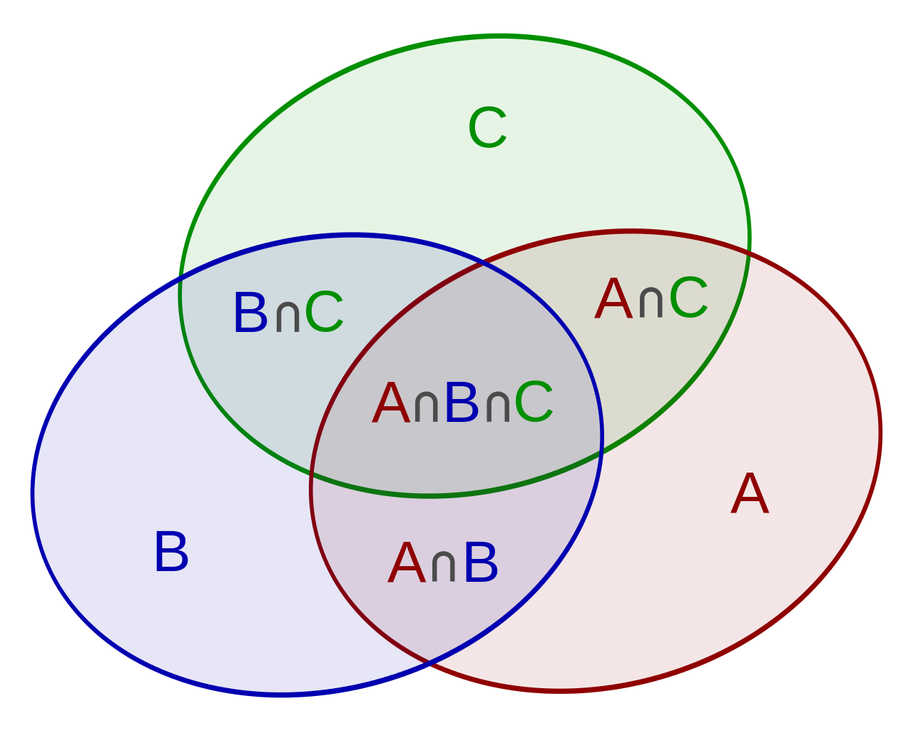
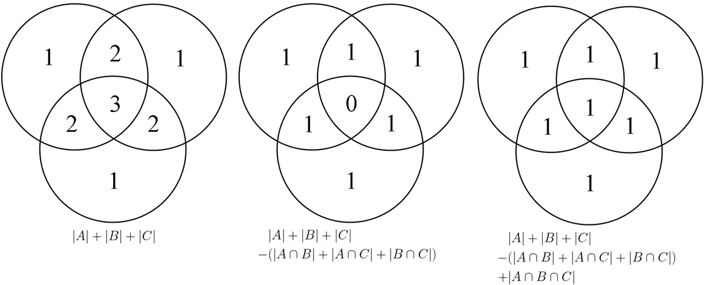

## 容斥原理

有一个集合$S = \{a_1,a_2,\cdots,a_n\}$,那么集合$S$的个数为$\vert S\vert$
序列$P_1,P_2,\cdots,P_k$,表示$k$种性质。那于性质$P_i$来说,元素$a_i$要么具有性质$P_i$,要么不具有性质$P_i$,$A_i$表示集合$S$中具有性质$P_i$的元素构成的子集。

问不具有性$P_1,P_2,\cdots,P_k$性质的元素的个数是多数，

显然 

$$
\vert S \vert - \vert \text{具有至少一个$P_i$性质的集合}\vert
$$

怎么求集合$S_2$:具有至少一个$P_i$性质的集合?

显然

$$
S_2 = A_1 \cup A_2 \cup \cdots \cup A_k = \bigcup_{i=1}^kA_i 
$$

于就是求$\vert S2 \vert$

$$
\begin{aligned}
\vert S_2 \vert &= \ \sum_{i=1}^k \vert A_i \vert + \\
        &+ (-1)^1 \ \ \sum_{1 \leqslant i < j n} \vert A_i \cap A_j \vert \\
        &+ (-1)^2 \sum_{1 \leqslant i < j < x \leqslant n} \vert A_i \cap A_j \cap A_x \vert \\
        \\
        &+ \cdots \\
        \\
        &+(-1)^{k-1}\vert A_1 \cap A_2 \cap \cdots \cap A_n \vert 

\end{aligned}
$$

可以写成一个公式为

$$
\Big\vert \bigcup_{i=1}^k A_i \Big\vert = \sum_{k=1}^n (-1)^{k-1}\Big(\sum_{1 \leqslant i_1 < \cdots i_k \leqslant n}\vert A_{i1} \cap A_{i2} \cap \cdots \cap A_{in} \vert \Big)
$$

两个集合的容斥原理  

n(A∪B)=n(A)+n(B) -n(A∩B)

三个集合的容斥原理

|A∪B∪C|=|A|+|B|+|C|-|A∩B|-|A∩C|-|B∩C|+|A∩B∩C|

## 证明

数学归纳法

## 参考

- [wikipedia 容斥原理][1]

[1]: https://zh.wikipedia.org/wiki/%E6%8E%92%E5%AE%B9%E5%8E%9F%E7%90%86 "wikipedia 容斥原理"