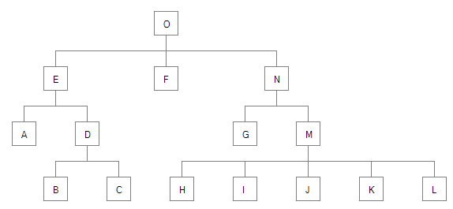
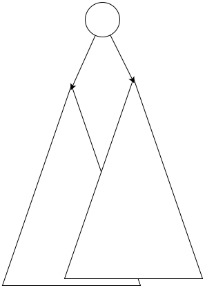

## 背景

一直想学习,相关的树布局算法,方便我可视化我的算法.加快我学习的速度

在我查找资料的过程中,似乎比较好的算法是: Reingold-Tilford Algorithm.但是比较简单,容易实现的是[John Q. Walker II 的算法][1]

## 前期准备

为了方便显示绘制树之后的效果,我这里使用了[wibbecanvas-cpp An implementation of the JavaScript canvas API in C++](https://github.com/wibbe/canvas-cpp) 这个库

这里给出几个简单封装的API

- 绘制结点 draw_node() 
- 绘制结点的边线

## 问题描述

有一个图如下:

显然每个结点的$y$坐标,很容易确定,就是所有树的层数,现在比较难确定的就是$x$的坐标,但是可以想到$x$的值与

1. 左边的结点的$x$值
2. 所有孩子的结点的$x$值形成的宽度(要放在中间位置)

## 开始

按下面的步骤来对树上的每个结点进行操作.

第一步,先序遍历整个树,如果$u$没有$adjacent\; node$,则$u.x = 0$,否则$u.x = adj.x + 1$

那么这时我们会得到一个类似这样的图

显然认识到,**父亲结点应该在所有的孩子结点的中间点**,为了后面的方便计算,我们给结点添加一个属性$mod$,他的意思是`modify`,表示结点在$x$的基础上应该偏移的值.显然这个$mod = x-childMiddleValue$
.如果$mod > 0$表示,所有的孩子应该都向右偏移

$mod$的值是告诉所有的孩子结点,需要移动的值,应该从上到下去设置

此时,可以想到,两个相邻的子树,可能会有冲突(重叠的)的情况,如何保证当前结点的子树,不会和左边相邻的子树冲突呢?

简单的想法是,一层一层的检查当前子树的最左侧结点$l$,是否和$left\; adjacent$相

   
至少这两点有关

核心思想:

从左边开始,
保证所有的子树都是不重的,layout合理的,然后根据left adjacent 和 孩子来决定自己的位置?

若mod是负值,应该怎么移动所有的孩子呢?

最后,遍历所有的结点,计算最终的$x$值

该算法对于生成界面节点元素要求如下：

1. Nodes at the same level of the tree should lie along a straight line, and the straight lines defining the levels should be parallel.（相同深度节点应排成一条直线，且直线间相互平行）

2. A parent should be centered over its offspring.（父节点在所有子节点上方中心位置）

3. A tree and its mirror image should produce drawings that are refiections of one another（不翻译了，意会一下，和我们常见的树形图差不多）

## 算法实现

<%- iframe("/canvas/jq_walker_tree_layout/index.html") %>

## 资料

- [A Node-Positioning Algorithm for General Trees (1989, John Q. Walker II)][1]
- https://github.com/woodybriggs/TreeLayoutJS
- http://www.pennelynn.com/Documents/CUJ/HTML/91HTML/19910056.HTM
- https://rachel53461.wordpress.com/2014/04/20/algorithm-for-drawing-trees/

[1]: http://www.cs.unc.edu/techreports/89-034.pdf "A Node-Positioning Algorithm for General Trees (1989, John Q. Walker II)"
