## 教学目标


- 使用小朋法来分解问题
- 理解递归的分支
- 理解递归是在树上的行走


## 题目

<%- include("./problem.md") %>


## 小朋友法

想像,有一个小朋友他的问题为:求斐波那契数列的第$n$项是什么,为了偷懒少写字,我们把这个问题设为:$f(n)$,根据数列的性质,这个聪明的小朋友找来另两个小朋友,分别去求$f(n-1),f(n-2)$,只要那两个小朋友的问题,那$f(n)$这个问题就解决了.显然,这两个小朋友还会再次去找其它小朋友,然后这样一直找下去,直到问题变为$f(1),f(2)$,这样问题就可以直接得出答案,因为$f(1),f(2)$太简单了,不需要计算.


加入有一个问题为$f(5)$的小朋友,那么整个问题的分解如下:




上面的图形有形状很像是一个倒过来的树,最上面的点$f(5)$就是树根.
类似这种类型的数据,我们称为树.

## 代码

```cpp
<%- include("./code.cpp") %>
```

## 代码理解

如何理解代码的运行过程呢?

请同学们使用磊方块法,在纸上模拟整个过程.

TODO:动画

一边磊方块,一边栈顶的函数$f(i)$,发现:**递归就是在树上的行走**

- 递归前进: 就是从树上的父亲到孩子
- 递归回溯: 就是从树上的孩子到父亲

## 总结

通过这个题目,我们学会了

分解子问题

你有一个问题$A$,我们发现可以通过求解子问题``B_1,B_2,\cdots,B_n``来解$A$
也就是说问题``A``可以**拆分**成子问题``B_1,B_2,\cdots,B_n``

且子问题``B_i``与原问题``A``是相似的,只是规模变小了,那么显然子问题``B_i``也可以拆分,直到边界


前进就是分解子问题

回溯就是子问题得到解,回到原问题``A``时

递归本质就是树上行走

## 题目

- luogu P1255 数楼梯
