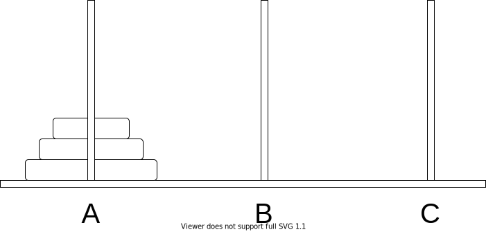
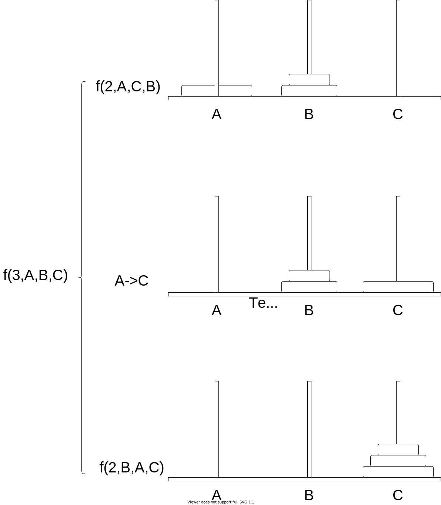

## 教学目标

- 使用小朋友法解题
- 绘制dfs树

## 汉诺塔游戏

汉诺塔（tower of Hanoi）问题。有$n$个大小不等的中空圆盘，按照从小到大的顺序迭套在立柱$A$上，另有两根立柱$B$和$C$。现要求把全部圆盘从$A$柱移到$C$柱的过程，移动过程中可借助$B$柱（中间柱）。




移动时有如下的要求：

1. 一次只移动一个盘；
1. 不允许把大盘放在小盘上边；
1. 可使用任意一根立柱暂存圆盘

在线游戏 : https://zhangxiaoleiwk.gitee.io/h.html

## 分析

通过上面的游戏,发现

- 一定要把前$n-1$个盘子移动到中间柱
- 起始柱现在只有一个盘子$n$,然后把第$n$个盘子移动到目标柱
- 最后把前$n-1$个盘子从中间柱移动到目标柱

设

- 起始柱:$A$
- 中间柱:$B$
- 目标柱:$C$
- 把前$n$盘子从起始柱移动到目标柱:$f(n,A,B,C)$
  - 第二个参数表示 起始柱是哪个柱,其它同理

现在想一想有一个小朋友,他的任务是:把前$n$盘子从起始柱移动到目标柱,$f(n,A,B,C)$,于是他找了$2$个小朋友,他们分别去求$f(n-1,A,C,B)$和$f(n-1,A,B,C)$，只要他们的问题都解决了，那么他的问题就解决了。



## 代码

```cpp
<%- include("./dfs.cpp") %>
```