[[TOC]]

## 教学目标

- 学习回溯
 - 代码的哪部分是回溯
- 进一步使用小朋友法


## 问题

<%- include("./problem.md") %>

## 解析


根据前面的所学习的内容,可以想像有$6$个小朋友,



1. 在递归的前进阶段

- 第$i$个小朋友输出自己的编号
- 然后通知右边的第$i+1$个小朋友做他的任务

2. 到达边界

到达第$6$个小朋友的时候,表示前面$5$个小朋友都完成了自己的任务,
应该进行整体任务的第二个阶段:输出第二行内容.

于是,第$6$个小朋友输出一个换行,然后通知左边的第$5$个小朋友,开始做任务.

3. 在递归的回溯阶段

- 第$i$个小朋友输出自己的编号,**然后离开**(因为他的所有的任务都完成了,所以可以走了)
- 然后通知左边的第$i-1$个小朋友做他的任务

想像你是其中的一个小朋友,不是边界,那么你的任务具体是什么呢?

- 如果是左边的小朋友通知我,我就输出我的编号
- 然后找一个小朋友作为我右边的小朋友,然后通知他
- 如果是右边的小朋友通知我,我就输出我的编号,然后离开

想一想,于是你发现:

- 每个小朋友的任务都一样,且很简单
- 边界小朋友的出现,表明前面的任务都完成了
- 所有完成简单任务的小朋友合作,就可以完成复杂的任务!


## 代码实现

```cpp
<%- include("./dfs.cpp") %>
```

## 代码的理解


使用磊方块的方式来理解代码,


图：TODO


于是发现

- 递归的前进阶段: 就是方块向上磊的时候,也就是调用下一层函数
- 递归的回溯阶段: 就是方块向下取走的时候,也就是当前层函数执行完,回到上一层函数的时候

所以递归本质上是在栈上的操作,不停的进栈(push),出栈(pop),直到到达边界

那么这个栈在哪里呢?我们并没有直接定义并使用栈啊?

这个栈是操作系统维护的,叫做调用栈,也就是调用函数时产生的栈,

当代码发生函数调用时,操作系统(可以认为是我们的电脑),在一块专门的内存区域上,叫做系统调用栈内存,申请一块新的内存区域来存放这个函数需要使用的的相关变量,然后把这个函数的地址压入栈内存中,然后再调用这个函数。

当这个函数调用结束后,操作系统(也可以认为是我们的电脑)会把这个函数的地址从栈内存中弹出，然后释放这个内存区域,根据地址回到调用函数的位置.