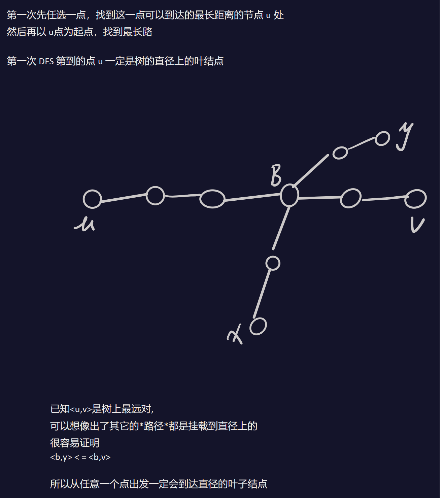
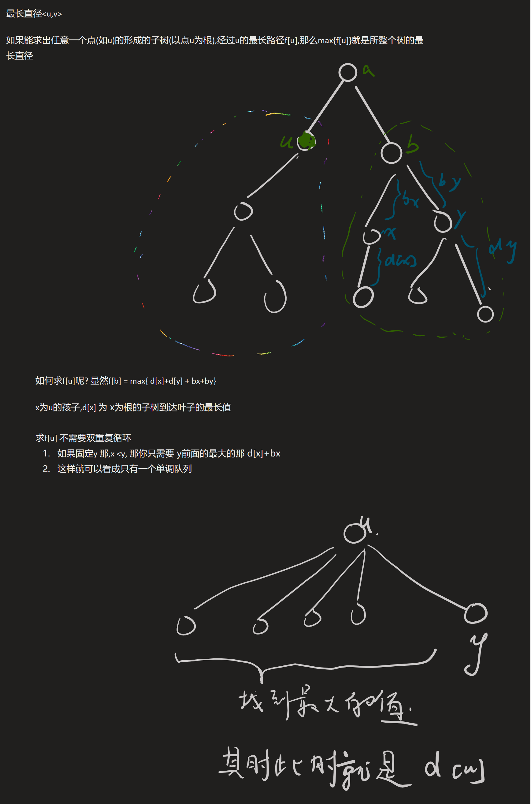

[[TOC]]

# 树的直径

## 定义

定义: 什么是树的直径: 树上面的最长的一条路径 , 被称为树的直径. 也叫树的最长路径，最远点对.

## 两次dfs求直径



题目地址: poj 1985 Cow Marathon

### 模板

```cpp
//TLP:tree_longest_path
namespace TLP {
    using namespace xlx1;
    typedef long long ll;
    ll node,dis;
    //len: 根到点u的距离
    void dfs(int u,int fa,int len){
        if(dis <len ) node = u, dis = len;
        for(int i = head[u];i!=-1;i=e[i].next){
            int v = e[i].v;
            if( v == fa) continue;
            dfs(v,u,len+e[i].w);
        }
    }
    void work(){
        dis=-1;dfs(1,0,0);   //第1次dfs
        dis=-1;dfs(node,0,0);//第2次dfs
        //得到最长的直径dis
    }
}
```
## dp求直径



### 代码模板

```cpp
void dp(int u) {
    vis[u] = 1;
    for(int i = e.h[u]; ~i ;i = e[i].neut) {
        int v = e[i].v;
        if(vis[v]) continue;
        dp(v);
        ans = max(ans,dp[u] + d[v] + e[i].w);
        d[u] = max(d[x],d[v] + e[i].w);
    }
}
```
