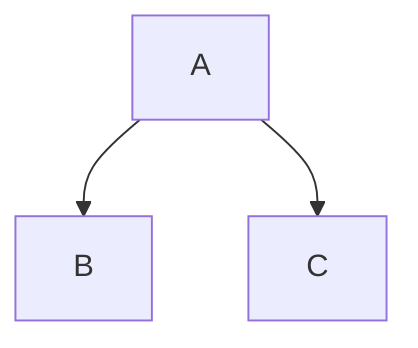
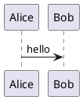
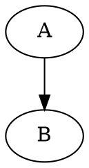

```cpp
#include <iostream>
int main() { std::cout << "hello" << std::endl; }
```







```pseudocode
\begin{algorithm}
\caption{示例}
\begin{algorithmic}
\STATE print("hello")
\end{algorithmic}
\end{algorithm}
```